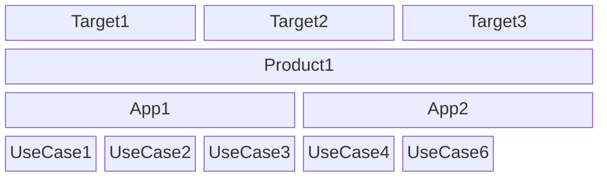
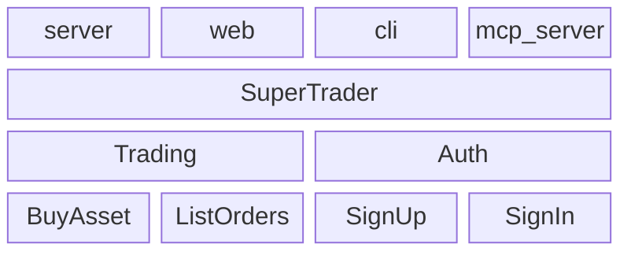

# libmodulor

An opinionated TypeScript library to create business oriented applications.

Applications created with `libmodulor` have **6 main properties** :

- Strictly typed with explicit business data types
- Fully typed e2e without code generation
- Auto documented
- Auto tested
- Multi platforms/runtimes
- Runnable anywhere

> [!WARNING]
> The project is still in active development. Although already used in pilot projects, it's not suitable for all production scenarios yet.
> Being developed by only one person, it may keep going for years or stop at any time.
> In the meantime, it's still a "research project" that needs improvement. Thus, it will be subject to BREAKING CHANGES as long as the version is not 1.0.0.

> [!NOTE]
> At the beginning, the whole documentation will be contained in this single file to make it easier to have the big picture and <kbd>cmd</kbd> + <kbd>F</kbd>. At some point, each section will move to a dedicated page. I'll even consider having a beautiful documentation website like all the cool kids.

All that said, the end goal is really to have a **production-grade library** to help everyone build **quality projects faster**. If you want to help in any way or have questions, feel free to contact me (cf. `author` in `package.json`).

## Philosophy

One might argue that, with so many "JS frameworks" on the market, there are already too many ways to build new applications today. And they would be right.

That's why the angle taken by `libmodulor` is different. Although opinionated about some things (see below), it is not, regarding the technical side. Instead, it focuses mainly on the "core" of your application.

Thus, you are free to use :

- the data store of your choice (PostgreSQL, MySQL, MariaDB, DynamoDB, SQLite, MongoDB...),
- the frontend framework of your choice (React, Svelte, Angular, Vue, Solid...),
- the server of your choice (Express, Fastify, Hono...),
- the meta framework of your choice (Next, Remix, Astro, Nuxt...),
- the runtime of your choice (Node, Deno, Bun...)
- the libraries of your choice (Lodash, React Query...)
- the tools of your choice (Biome, ESLint, Prettier...)
- the styling library of your choice for web (tailwind, shadcn, bootstrap, vanilla CSS...)
- the hosting of your choice (Cloud, IaaS, PaaS, On-Prem, RaspberryPi, your fridge...)

The main goal is to offer higher level primitives that make building business applications faster, without having to use a boilerplate or worse, no/low code, and thus, avoid vendor lock-in.

## How it works

The library defines a **4-layer architecture** composed of : `UseCase`, `App`, `Product`, `Target`.



### UseCase

A use case is the smallest unit. It defines the contract, mainly as an `Input` that goes into lifecycle methods (`client` and/or `server`) to finally give an `Output`. In the end, it constitutes a piece of business functionality.

Inspired by [UML's Use case diagram](https://en.wikipedia.org/wiki/Use_case_diagram) and [Event-driven architecture](https://en.wikipedia.org/wiki/Event-driven_architecture), schematically, it could be defined as follows :

```math
O = clientMain(serverMain(I))
```

_Examples : `SignIn`, `CreatePost`, `TransferAccount`, `InviteContacts`_...

Note how it always starts with a verb.

### App

An app is a logical group of use cases.

It's like a "module" (_whatever that means_), inspired by [Domain-driven design (DDD)](https://en.wikipedia.org/wiki/Domain-driven_design) bounded contexts.

_Examples : `Auth`, `Accounting`, `CMS`..._

### Product

A product is a logical group of apps that are assembled together.

Behind this barbaric definition, it's simply what end users know and use.

_Examples : `GitHub`, `Facebook`, `LinkedIn`, `Airbnb`..._

When defined correctly, apps are reusable across multiple products (e.g. `Auth`).

### Target

A target defines how a product is "exposed" to the end user. It's a combination of platform and runtime.

_Examples : `web-react`, `web-angular`, `server-node`, `cli-node`, `cli-stricli`..._

Note that it's the only place where the "infrastructure" choices are applied.

## Getting Started

Enough theory, let's dive in and learn by doing.

> [!NOTE]
> This Guide is voluntarily very verbose and not scripted so you can get a full overview of how things work. `npx` magic is good. But understanding what happens behind the scenes is good as well.

In this Guide, we'll init a repository (a repository can contain multiple apps and products) and create a real life application using the `libmodulor` primitives.

We'll build a small trading application. It will contain one `App` named `Trading`, which will contain one `UseCase` named `BuyAsset`. The `App` will be mounted in a `Product` called `SuperTrader` which will be exposed via a `server` `Target`, a `web` `Target`, a `cli` `Target` and finally, a `mcp-server` `Target`.

> [!NOTE]
> MCP stands for [Model Context Protocol](https://modelcontextprotocol.io) introduced recently by [@anthropics](https://github.com/anthropics).

If we adapt the abstract mermaid chart displayed above, concretely, it looks like this :



Note that we'll only develop one use case in this Guide but you get the idea.

### Create the project

> [!IMPORTANT]
> At this stage, I'm following a documentation and spec first process. Thus, the source code is not yet published, just like the package on `npm`. Therefore, the commands below are not fully executable since `yarn install` will fail fetching the dependency. Currently, the main goal is to expose the docs, optimize the process, and most of all, get feedback on the mechanism. Thank you.

Assuming you have the following installed (otherwise, install them or adapt the commands) :

- `node` >= 22
- `yarn` >= 1.x
- `wget` and `curl`

If you're on macOS, for the `sed` commands, add a `''` after `-i` ([Explanation](https://stackoverflow.com/a/4247319/1259118)).

```sh
# Create the directory
mkdir libmodulor-tuto && cd libmodulor-tuto # Note how the repository is generic to contain multiple apps and products

# Initialize git
git init

# Initialize config files
touch .gitignore biome.json package.json README.md tsconfig.json vitest.config.ts
```

#### .gitignore

```.gitignore
coverage
dist
node_modules
src/apps/**/test/reports
.env
```

#### biome.json

```json
{
    "$schema": "./node_modules/@biomejs/biome/configuration_schema.json",
    "files": {
        "ignore": ["coverage", "dist", "node_modules"],
        "ignoreUnknown": true
    },
    "formatter": {
        "indentStyle": "space",
        "indentWidth": 4
    },
    "javascript": {
        "formatter": {
            "quoteStyle": "single"
        },
        "parser": {
            "unsafeParameterDecoratorsEnabled": true
        }
    }
}
```

#### package.json

```json
{
    "name": "libmodulor-tuto",
    "version": "0.1.0",
    "author": "Chafik H'nini <chafik.hnini@gmail.com>",
    "type": "module",
    "private": true,
    "scripts": {
        "cli": "node ./node_modules/libmodulor/dist/esm/products/Wizard/index.js",
        "lint": "biome check --write .",
        "test": "tsc && vitest run"
    },
    "dependencies": {
        "libmodulor": "c100k/libmodulor#master",
        "inversify": "^6.2.1",
        "reflect-metadata": "^0.2.2"
    },
    "devDependencies": {
        "@biomejs/biome": "^1.9.4",
        "@types/node": "^22.10.2",
        "@vitest/coverage-v8": "^2.1.1",
        "buffer": "^6.0.3",
        "cookie-parser": "^1.4.7",
        "express": "^4.21.2",
        "express-fileupload": "^1.5.1",
        "fast-check": "^3.23.2",
        "helmet": "^8.0.0",
        "jose": "^5.9.6",
        "typescript": "^5.7.2",
        "vite": "^6.0.5",
        "vitest": "^2.1.8"
    }
}
```

#### README.md

```md
# libmodulor-tuto

🚀🚀🚀
```

#### tsconfig.json

```json
{
    "compilerOptions": {
        "allowSyntheticDefaultImports": true,
        "declaration": true,
        "lib": ["dom", "esnext"],
        "module": "NodeNext",
        "moduleResolution": "NodeNext",
        "noEmit": true,
        "removeComments": true,
        "skipLibCheck": true,
        "sourceMap": true,
        "target": "ESNext",

        "strict": true,
        "allowUnreachableCode": false,
        "allowUnusedLabels": false,
        "exactOptionalPropertyTypes": true,
        "noFallthroughCasesInSwitch": true,
        "noPropertyAccessFromIndexSignature": true,
        "noImplicitOverride": true,
        "noImplicitReturns": true,
        "noUncheckedIndexedAccess": true,
        "noUnusedLocals": true,
        "noUnusedParameters": true,
        "verbatimModuleSyntax": true,

        "emitDecoratorMetadata": true,
        "experimentalDecorators": true,

        "jsx": "react"
    }
}
```

#### vitest.config.ts

```typescript
import { defineConfig } from 'vitest/config';

export default defineConfig({
    test: {
        coverage: {
            enabled: true,
            exclude: ['src/apps/**/test', 'src/**/*.test.ts'],
            include: ['src'],
            reporter: ['html', 'lcov', 'text'],
        },
        reporters: ['verbose'],
    },
});
```

#### Install

```sh
yarn install
```

```sh
yarn lint && git add . && git commit -m "chore: init source code"
```

Optionally, you can create a remote repository (e.g. on GitHub) and push it.

### Create the App

An app is composed of three main files : `i18n.ts`, `manifest.ts` and `index.ts`.

```sh
mkdir -p src/apps/Trading/src/ucds
touch src/apps/Trading/src/{i18n.ts,manifest.ts}
touch src/apps/Trading/index.ts
```

> [!NOTE]
> There is a lot of controversy about barrel files. In this specific context, they are useful to only expose the necessary things to the upper layers and keep the app isolated.

#### i18n.ts

```typescript
import type { AppI18n } from 'libmodulor';

export const I18n: AppI18n = {
    en: {},
};
```

#### manifest.ts

```typescript
import type { AppManifest } from 'libmodulor';

export const Manifest = {
    languageCodes: ['en'],
    name: 'Trading',
    ucReg: {},
} satisfies AppManifest;
```

#### index.ts

```typescript
// Expose only what's necessary

export { I18n } from './src/i18n.js';
export { Manifest } from './src/manifest.js';
```

```sh
yarn lint && git add . && git commit -m "feat: add the app"
```

### Create the UseCase

> [!NOTE]
> Starting now, you'll see `UC` or `uc` a lot. It's the abbreviation of `UseCase`. Acronyms are not good in codebases, except those that are commonly used ([debate](https://stackoverflow.com/questions/2236807/java-naming-convention-with-acronyms)). In any case, when you write `UseCase` hundreds of times, you're happy to be able to write `UC` instead. Thus, `UCD` stands for `Use Case Definition`, `UCIF` stands for `Use Case Input Field` and so on.

The app manifest registers all the use cases metadata. Use cases can depend on each other as we'll see later, and this dependency must go through the manifest. Never directly.

Update `manifest.ts` to register the new use case.

```typescript
    // ...
    ucReg: {
        BuyAsset: {
            action: 'Create',
            icon: 'plus',
            name: 'BuyAsset',
        },
    },
    // ...
```

If you're using an IDE with auto-complete, you might have noticed the other properties like `beta`, `new`, `sensitive`. We'll come back to them later.

```sh
mkdir src/apps/Trading/src/dt
touch src/apps/Trading/src/dt/TISIN.ts
touch src/apps/Trading/src/ucds/{BuyAssetServerMain.ts,BuyAssetUCD.ts}
```

#### TISIN.ts

An asset is usually identified by a unique code called [ISIN](https://www.isin.org). This is a typical business data type that has specific rules and that is not simply a `string`.

```typescript
import { type TName, TString, type TStringConstraints } from 'libmodulor';

export type ISIN = Capitalize<string>;

export class TISIN extends TString<ISIN, 'ISIN'> {
    public static readonly FORMAT: RegExp = /^[A-Z]{2}[A-Z0-9]{9}[0-9]$/;

    constructor(constraints?: TStringConstraints) {
        super({
            ...constraints,
            format: { f: 'ISIN', regexp: TISIN.FORMAT },
        });
    }

    public override tName(): TName {
        return 'ISIN';
    }

    public override example(): ISIN {
        return 'US02079K3059';
    }
}
```

#### BuyAssetUCD.ts

```typescript
import {
    type AggregateOPI0,
    type Amount,
    EverybodyUCPolicy,
    TAmount,
    TBoolean,
    TUIntQuantity,
    type UCDef,
    type UCInput,
    type UCInputFieldValue,
    type UCMain,
    type UCMainInput,
    type UCOutputOrNothing,
    type UCTransporter,
    type UIntQuantity,
} from 'libmodulor';
import { inject, injectable } from 'inversify';

import { Manifest } from '../manifest.js';

import { type ISIN, TISIN } from '../dt/TISIN.js';
import { BuyAssetServerMain } from './BuyAssetServerMain.js';

export interface BuyAssetInput extends UCInput {
    isin: UCInputFieldValue<ISIN>;
    limit: UCInputFieldValue<Amount>;
    qty: UCInputFieldValue<UIntQuantity>;
}

export interface BuyAssetOPI0 extends AggregateOPI0 {
    executedDirectly: boolean;
}

@injectable()
class BuyAssetClientMain implements UCMain<BuyAssetInput, BuyAssetOPI0> {
    constructor(
        @inject('UCTransporter')
        private ucTransporter: UCTransporter,
    ) {}

    public async exec({
        uc,
    }: UCMainInput<BuyAssetInput, BuyAssetOPI0>): Promise<
        UCOutputOrNothing<BuyAssetOPI0>
    > {
        return this.ucTransporter.send(uc);
    }
}

export const BuyAssetUCD: UCDef<BuyAssetInput, BuyAssetOPI0> = {
    io: {
        input: {
            fields: {
                isin: {
                    type: new TISIN(),
                },
                limit: {
                    type: new TAmount('USD'),
                },
                qty: {
                    type: new TUIntQuantity(),
                },
            },
        },
        output: {
            parts: {
                _0: {
                    fields: {
                        executedDirectly: {
                            type: new TBoolean(),
                        },
                    },
                },
            },
        },
    },
    lifecycle: {
        client: {
            main: BuyAssetClientMain,
            policy: EverybodyUCPolicy,
        },
        server: {
            main: BuyAssetServerMain,
            policy: EverybodyUCPolicy,
        },
    },
    metadata: Manifest.ucReg.BuyAsset,
};
```

#### BuyAssetServerMain.ts

```typescript
import {
    type UCMain,
    type UCMainInput,
    type UCManager,
    type UCOutput,
    UCOutputBuilder,
} from 'libmodulor';
import { inject, injectable } from 'inversify';

import type { BuyAssetInput, BuyAssetOPI0 } from './BuyAssetUCD.js';

@injectable()
export class BuyAssetServerMain implements UCMain<BuyAssetInput, BuyAssetOPI0> {
    constructor(@inject('UCManager') private ucManager: UCManager) {}

    public async exec({
        uc,
    }: UCMainInput<BuyAssetInput, BuyAssetOPI0>): Promise<
        UCOutput<BuyAssetOPI0>
    > {
        // >=> Persist the order
        const { aggregateId } = await this.ucManager.persist(uc);

        // >=> TODO : Check the user has enough funds to place the order

        // >=> TODO : Send the order to a queue for processing
        const executedDirectly: BuyAssetOPI0['executedDirectly'] = false;

        return new UCOutputBuilder<BuyAssetOPI0>()
            .add({
                executedDirectly,
                id: aggregateId,
            })
            .get();
    }
}
```

For now, we won't detail all this code but take the time to read it and understand how it works. Hopefully it's clear enough and self-explanatory.

> [!TIP]
> Using a comment following the pattern `// >=> ` in `ClientMain` and `ServerMain` has a specific meaning as we'll see a little bit later.

> [!NOTE]
> Unlike `ClientMain`, `ServerMain` is put in another file for "historical" reasons, mainly for stripping and tree shaking reasons. More on this later.

```sh
yarn lint && git add . && git commit -m "feat: add the use case"
```

### Test the App

#### Preliminary test

By default, we rely on [vitest](https://vitest.dev) to run the tests and [@vitest/coverage-v8](https://vitest.dev/guide/coverage) for the coverage.

```sh
yarn test
```

```sh
 % Coverage report from v8
------------------------|---------|----------|---------|---------|-------------------
File                    | % Stmts | % Branch | % Funcs | % Lines | Uncovered Line #s 
------------------------|---------|----------|---------|---------|-------------------
All files               |       0 |       40 |      40 |       0 |                   
 Trading                |       0 |        0 |       0 |       0 |                   
  index.ts              |       0 |        0 |       0 |       0 | 1                 
 Trading/src            |       0 |      100 |     100 |       0 |                   
  i18n.ts               |       0 |      100 |     100 |       0 | 3-5               
  manifest.ts           |       0 |      100 |     100 |       0 | 3-14              
 Trading/src/ucds       |       0 |        0 |       0 |       0 |                   
  BuyAssetServerMain.ts |       0 |        0 |       0 |       0 | 1-28              
  BuyAssetUCD.ts        |       0 |        0 |       0 |       0 | 1-92              
------------------------|---------|----------|---------|---------|-------------------
```

As expected, the coverage report is pretty lame. Which is understandable, since we haven't written any tests yet.

```sh
mkdir src/apps/Trading/test
touch src/apps/Trading/test/Configurator.ts
```

#### Configurator.ts

```typescript
import { type AppTesterCtx, type CryptoManager, bindCommon } from 'libmodulor';
import {
    NodeDeterministicCryptoManager,
    bindNodeCore,
    bindServer,
} from 'libmodulor/node';
import { SimpleAppTesterConfigurator } from 'libmodulor/node-test';
import { injectable } from 'inversify';

@injectable()
export class Configurator extends SimpleAppTesterConfigurator {
    public override async bindImplementations(
        ctx: AppTesterCtx,
    ): Promise<void> {
        await super.bindImplementations(ctx);

        const { container } = ctx;

        bindCommon(container);
        bindNodeCore(container);
        bindServer(container);

        container
            .rebind<CryptoManager>('CryptoManager')
            .to(NodeDeterministicCryptoManager);
    }
}
```

#### Automated test

Generate the automated tests and execute them with the CLI (it does more than a simple `yarn test`).

```sh
yarn cli GenerateAppsTests
yarn cli TestApp --appName Trading
```

```sh
 % Coverage report from v8
------------------------|---------|----------|---------|---------|-------------------
File                    | % Stmts | % Branch | % Funcs | % Lines | Uncovered Line #s 
------------------------|---------|----------|---------|---------|-------------------
All files               |   98.83 |       80 |      80 |   98.83 |                   
 Trading                |       0 |        0 |       0 |       0 |                   
  index.ts              |       0 |        0 |       0 |       0 | 1                 
 Trading/src            |     100 |      100 |     100 |     100 |                   
  i18n.ts               |     100 |      100 |     100 |     100 |                   
  manifest.ts           |     100 |      100 |     100 |     100 |                   
 Trading/src/ucds       |     100 |      100 |     100 |     100 |                   
  BuyAssetServerMain.ts |     100 |      100 |     100 |     100 |                   
  BuyAssetUCD.ts        |     100 |      100 |     100 |     100 |                   
------------------------|---------|----------|---------|---------|-------------------
2024-12-29T11:00:53.178Z [info] Coverage Report => open src/apps/Trading/test/reports/coverage/index.html
2024-12-29T11:00:53.178Z [info] Simple HTML Report => open src/apps/Trading/test/reports/simple-html/index.html
```

That's much better. Without writing any line of test code, we've reached almost 100% coverage. Although coverage is a vanity metric in some way, it still is a valuable one.

Note another important thing : auto documentation. Check out the generated `src/apps/Trading/README.md` that shows a mermaid chart for each use case and a technical summary. This is very valuable to whoever wants to understand what the app does.

To vizualize the mermaid chart, you can copy/paste it [here](https://mermaid.live) or if you've published your repository to GitHub, they are displayed out of the box.


You can see how the special comments we've mentioned earlier show up in this chart. It's nice in order to describe with more details what happens at each step.

Note also the generated "Coverage Report" and the "Simple HTML Report". The former is provided by `c8` while the other is built by `libmodulor`. It gives a great overview of the test scenarios.

> [!NOTE]
> You might have seen that `Configurator` is extensible. It allows you to define specific flows to test a suite of use cases, define specific assertions, etc.

```sh
yarn lint && git add . && git commit -m "test: init app tests"
```

### Create the Product

Like the app, the product has a `i18n.ts` and `manifest.ts`.

```sh
mkdir -p src/products/SuperTrader
touch src/products/SuperTrader/{i18n.ts,manifest.ts}
```

#### i18n.ts

```typescript
import type { ProductI18n } from 'libmodulor';
import { I18nEN } from 'libmodulor/locales/en';

import { I18n as TradingI18n } from '../../apps/Trading/index.js';

export const I18n: ProductI18n = {
    en: {
        ...I18nEN,
        ...TradingI18n.en,
        p_desc: 'A simple app to trade crypto, shares and other assets',
        p_slogan: 'Trading made simple',
    },
};
```

#### manifest.ts

```typescript
import type { ProductManifest } from 'libmodulor';

export const Manifest: ProductManifest = {
    appReg: [{ name: 'Trading' }],
    name: 'SuperTrader',
};
```

> [!NOTE]
> The same way we register use cases in an app, we register apps in a product. Since apps are reusable across products, you can even exclude some use cases for a given product.

```sh
yarn lint && git add . && git commit -m "feat: add the product"
```

### Create the server Target

We'll use the pre-built [express](https://expressjs.com) `ServerManager`.

```sh
mkdir src/products/SuperTrader/server
touch src/products/SuperTrader/server/{container.ts,index.ts}
touch tsconfig.build.json
touch .env
```

#### container.ts

```typescript
import {
    CONTAINER_OPTS,
    EnvSettingsManager,
    type ServerManager,
    type ServerManagerSettings,
    type SettingsManager,
    TARGET_DEFAULT_SERVER_MANAGER_SETTINGS,
    bindCommon,
    bindProduct,
} from 'libmodulor';
import {
    NodeExpressServerManager,
    bindNodeCore,
    bindServer,
} from 'libmodulor/node';
import { Container } from 'inversify';

import { I18n } from '../i18n.js';
import { Manifest } from '../manifest.js';

type S = ServerManagerSettings;

const container = new Container(CONTAINER_OPTS);

bindCommon<S>(container, () => ({
    ...TARGET_DEFAULT_SERVER_MANAGER_SETTINGS,
}));
bindNodeCore(container);
bindServer(container);
bindProduct(container, Manifest, I18n);

container.rebind<SettingsManager>('SettingsManager').to(EnvSettingsManager);

container.bind<ServerManager>('ServerManager').to(NodeExpressServerManager);

export default container;
```

#### index.ts

```typescript
import {
    APPS_ROOT_DIR_NAME,
    type FSManager,
    type I18nManager,
    ServerBooter,
} from 'libmodulor';

import container from './container.js';

await container.get<I18nManager>('I18nManager').init();

await container.resolve(ServerBooter).exec({
    appsRootPath: container
        .get<FSManager>('FSManager')
        .path('..', '..', '..', APPS_ROOT_DIR_NAME),
    srcImporter: (path) => import(path),
});
```

#### tsconfig.build.json

```json
{
    "extends": "./tsconfig.json",
    "compilerOptions": {
        "noEmit": false,
        "outDir": "dist"
    },
    "include": ["src"]
}
```

#### .env

```properties
app_logger_level=trace # the default is 'debug'
```

> [!TIP]
> A setting named `my_setting` in the code can be overriden with an environment variable called `app_my_setting`.

#### Build & Run

Update `package.json` to add new entries to the `scripts`.

```json
"build": "tsc --project tsconfig.build.json && cp .env dist/products/SuperTrader/server/.env",
"run:server": "cd dist/products/SuperTrader/server && node --env-file .env index.js",
```

```sh
yarn build && yarn run:server
```

Et voilà ! The server is running !

```sh
curl -X POST -H "Content-Type: application/json" http://localhost:7443/api/v1/BuyAsset
# ❌ {"message":"Invalid credentials"}
curl -X POST -H "Content-Type: application/json" -H "X-API-Key: PublicApiKeyToBeChangedWhenDeploying" http://localhost:7443/api/v1/BuyAsset
# ❌ {"message":"isin must be filled"}
curl -X POST -H "Content-Type: application/json" -H "X-API-Key: PublicApiKeyToBeChangedWhenDeploying" -d '{"isin":"US02079K3059","limit":123.5,"qty":150}' http://localhost:7443/api/v1/BuyAsset
# ✅ {"parts":{"_0":{"items":[{"executedDirectly":false,"id":"95dddca5-5e9d-48ac-a90c-71a58d4e8554"}],"total":1}}}
```

As you can see, validation comes out of the box. Later we'll see how to add even more precise rules to the data types.

> [!NOTE]
> The `public_api_key` is just a first layer of security to "authenticate" the client apps calling the server. Hopefully this is not the only security mechanism because of course, this key must be present in clear client side (web, cli, curl...). We'll dive deeper in security when we study the policies.

```sh
yarn lint && git add . && git commit -m "feat: add the server target"
```

### Create the web Target

We'll use the pre-built [React](https://react.dev) components to build a SPA (Single Page Application), bundled with [vite](https://vite.dev) and served with the server defined above.

> [!WARNING]
> For readers used to "beautiful" websites à la Linear, Vercel and related, your eyes will burn. You're going to discover the simple and pure CSS-less Web. The most beautiful one.
> Of course, feel free to add CSS if you want to. The main goal here is to focus on the essence of the UI and not the UI design.

```sh
yarn add --dev "@types/react@^18.3.17" "@types/react-dom@^18.3.5"
yarn add "react@^18.3.1" "react-dom@^18.3.1"

mkdir -p src/products/SuperTrader/web/components
touch src/products/SuperTrader/vite.config.web.ts
touch src/products/SuperTrader/web/{container.ts,index.html,index.tsx}
touch src/products/SuperTrader/web/components/App.tsx
```

#### vite.config.web.ts

```typescript
import { join } from 'node:path';

import { StripUCDLifecycleServerPlugin } from 'libmodulor/vite';
import { defineConfig } from 'vite';

const base = process.cwd();
const root = join('src', 'products', 'SuperTrader', 'web');
const outDir = join(
    base,
    'dist',
    'products',
    'SuperTrader',
    'server',
    'public',
);

export default defineConfig({
    build: {
        emptyOutDir: true,
        outDir,
    },
    plugins: [StripUCDLifecycleServerPlugin],
    root,
});
```

#### container.ts

```typescript
import {
    CONTAINER_OPTS,
    type ServerClientManagerSettings,
    TARGET_DEFAULT_SERVER_CLIENT_MANAGER_SETTINGS,
    bindCommon,
    bindProduct,
} from 'libmodulor';
import { bindWeb } from 'libmodulor/web';
import { Container } from 'inversify';

import { I18n } from '../i18n.js';
import { Manifest } from '../manifest.js';

type S = ServerClientManagerSettings;

const container = new Container(CONTAINER_OPTS);

bindCommon<S>(container, () => ({
    ...TARGET_DEFAULT_SERVER_CLIENT_MANAGER_SETTINGS,
}));
bindWeb(container);
bindProduct(container, Manifest, I18n);

export default container;
```

#### index.html

```html
<!DOCTYPE html>
<html lang="en">
    <head>
        <meta charset="utf-8" />
        <meta content="width=device-width, initial-scale=1" name="viewport"
        />
    </head>
    <body>
        <div id="root"></div>
        <script type="module" src="/index.tsx"></script>
    </body>
</html>
```

#### App.tsx

Update `src/apps/Trading/index.ts` to expose the use case.

```typescript
export { BuyAssetUCD } from './src/ucds/BuyAssetUCD.js';
```

Naturally, in real life scenarios, we would never have such a bloated `App.tsx` and we could create fine-grained components. Everybody does that, right ?

```tsx
import { type Logger, type ProductManifest, UCOutputReader } from 'libmodulor';
import {
    UCPanel,
    type UCPanelOnError,
    useDIContext,
    useUC,
    useUCOR,
} from 'libmodulor/react';
import {
    UCAutoExecLoader,
    UCExecTouchable,
    UCForm,
} from 'libmodulor/react-web-pure';
import React, { useEffect, useState, type ReactElement } from 'react';

import { BuyAssetUCD, Manifest } from '../../../../apps/Trading/index.js';

export default function App(): ReactElement {
    const { container, i18nManager, wordingManager } = useDIContext();
    const [logger] = useState(container.get<Logger>('Logger'));
    const [productManifest] = useState(
        container.get<ProductManifest>('ProductManifest'),
    );

    const [buyAssetUC] = useUC(Manifest, BuyAssetUCD, null);
    const [buyAssetPart0, _buyAssetPart1, { append0 }] = useUCOR(
        new UCOutputReader(BuyAssetUCD, undefined),
    );

    const [loading, setLoading] = useState(true);

    useEffect(() => {
        (async () => {
            logger.debug('Initializing i18n');
            await i18nManager.init();
            logger.debug('Done initializing i18n');
            setLoading(false);
        })();

        const { slogan } = wordingManager.p();
        document.title = `${productManifest.name} : ${slogan}`;
    }, [i18nManager, logger, productManifest, wordingManager]);

    const onError: UCPanelOnError = async (err) => alert(err.message);

    const { slogan } = wordingManager.p();
    const { label } = wordingManager.uc(buyAssetUC.def);
    const { label: idLabel } = wordingManager.ucof('id');
    const { label: executedDirectlyLabel } =
        wordingManager.ucof('executedDirectly');

    return (
        <div>
            {loading && 'Loading...'}

            {!loading && (
                <>
                    <h1>
                        {productManifest.name} : {slogan}
                    </h1>

                    <h2>{label}</h2>

                    <UCPanel
                        clearAfterExec={false}
                        onDone={async (ucor) => append0(ucor)}
                        onError={onError}
                        renderAutoExecLoader={UCAutoExecLoader}
                        renderExecTouchable={UCExecTouchable}
                        renderForm={UCForm}
                        sleepInMs={200} // Fake delay to see submit wording changing
                        uc={buyAssetUC}
                    />

                    <table>
                        <thead>
                            <tr>
                                <th>{idLabel}</th>
                                <th>{executedDirectlyLabel}</th>
                            </tr>
                        </thead>
                        <tbody>
                            {buyAssetPart0?.items.map((i) => (
                                <tr key={i.id}>
                                    <td>{i.id}</td>
                                    <td>{i.executedDirectly ? '✅' : '❌'}</td>
                                </tr>
                            ))}
                        </tbody>
                        <tfoot>
                            <tr>
                                <th>{i18nManager.t('total')}</th>
                                <th>{buyAssetPart0?.pagination.total}</th>
                            </tr>
                        </tfoot>
                    </table>
                </>
            )}
        </div>
    );
}
```

#### index.tsx

```typescript
import { DIContextProvider } from 'libmodulor/react';
import React, { StrictMode } from 'react';
import ReactDOM from 'react-dom/client';

import App from './components/App.js';
import container from './container.js';

const rootElt = document.getElementById('root');
if (!rootElt) {
    throw new Error('Add a div#root in index.html');
}

ReactDOM.createRoot(rootElt).render(
    <StrictMode>
        <DIContextProvider container={container}>
            <App />
        </DIContextProvider>
    </StrictMode>,
);
```

#### Build & Run

Update `package.json` to add the `web` build to the `build` command.

```json
"build": "tsc --project tsconfig.build.json && cp .env dist/products/SuperTrader/server/.env && vite -c src/products/SuperTrader/vite.config.web.ts build",
```

Update `src/products/SuperTrader/server/container.ts` to mount the `public` directory.

```diff
...TARGET_DEFAULT_SERVER_MANAGER_SETTINGS,
+server_static_dir_path: 'public',
```

Press <kbd>ctrl</kbd> + <kbd>C</kbd> to stop the server (we'll setup hot reload later).

```sh
yarn build && yarn run:server
open http://localhost:7443
```

Et voilà ! The server is running ! Fill the form and see how it automatically submits to the server with client side and server side validation out of the box.


```sh
yarn lint && git add . && git commit -m "feat: add the web target"
```

### Switch to a persistent data storage

By default, the data is stored in memory on the server. Therefore, whenever we restart it, we lose everything. That is not very practical in real life scenarios. Let's use SQLite instead.

```sh
yarn add "knex@^3.1.0" "sqlite3@^5.1.7"
```

Update `src/products/SuperTrader/server/container.ts` to change the implementation.

```diff
[...]
    TARGET_DEFAULT_SERVER_MANAGER_SETTINGS,
+    type UCDataStore,
[...]
+import { KnexUCDataStore } from 'libmodulor/uc-data-store/knex';
[...]
+type S = KnexUCDataStoreSettings & ServerManagerSettings;
[...]
    ...TARGET_DEFAULT_SERVER_MANAGER_SETTINGS,
+    knex_uc_data_store_conn_string: 'postgresql://toto',
+    knex_uc_data_store_file_path: 'uc-data-store.sqlite',
+    knex_uc_data_store_pool_max: 5,
+    knex_uc_data_store_pool_min: 0,
+    knex_uc_data_store_type: 'sqlite3',
    server_static_dir_path: 'public',
[...]
container.rebind<SettingsManager>('SettingsManager').to(EnvSettingsManager);
+container.rebind<UCDataStore>('UCDataStore').to(KnexUCDataStore);
```

Press <kbd>ctrl</kbd> + <kbd>C</kbd> to stop the server.

```sh
yarn build && yarn run:server
```

Fill and submit the use case multiple times.

Open the SQLite database with you with your favorite DB editor (e.g. TablePlus, DBeaver...).

```sh
open dist/products/SuperTrader/server/uc-data-store.sqlite
```

You should see all your submissions stored in the database.

```sh
yarn lint && git add . && git commit -m "feat: persist data in SQLite"
```

### Define wording for humans

By default, the UI simply "humanizes" the use case field keys. It's fine for technical people, but not for humans.

Update `src/apps/Trading/src/i18n.ts` and add the following keys to `en`.

```typescript
uc_BuyAsset_label: 'Buy an asset',
uc_BuyAsset_i_submit_idle: 'Send buy order',
uc_BuyAsset_i_submit_submitting: 'Sending',
ucif_isin_label: 'ISIN',
ucif_qty_label: 'Quantity',
ucof_executedDirectly_label: '🚀 Executed directly',
ucof_id_label: 'Identifier',
validation_format_ISIN:
    'Must be 2 uppercase letters, followed by 9 alphanumeric characters and 1 digit',
```

Update `src/products/SuperTrader/i18n.ts` and add the following keys to `en`.

```typescript
total: 'Total',
```

> [!NOTE]
> We distinguish what's related to the app from what's related to the product. Usually, in the app's `i18n`, you'll add only translations following a certain convention like `dt_*` (data type choices), `err_*` (error messages), `uc_*` (use cases), `ucif_*` (use case input fields), `ucof_*` (use case output fields), `validation_*` (validation messages), etc.

Press <kbd>ctrl</kbd> + <kbd>C</kbd> to stop the server.

```sh
yarn build && yarn run:server
```

Refresh the page. You should see a better wording. Try to type an invalid `ISIN` and see how the full validation message is displayed as well.


```sh
yarn lint && git add . && git commit -m "feat: define wording for humans"
```

### Create the cli Target

We'll use the pre-built [Node.js parseArgs](https://nodejs.org/api/util.html#utilparseargsconfig) CLI program.

```sh
mkdir src/products/SuperTrader/cli
touch src/products/SuperTrader/cli/{container.ts,index.ts}
```

#### container.ts

```typescript
import {
    CONTAINER_OPTS,
    type ServerClientManagerSettings,
    TARGET_DEFAULT_SERVER_CLIENT_MANAGER_SETTINGS,
    bindCommon,
    bindProduct,
} from 'libmodulor';
import { bindNodeCLI, bindNodeCore } from 'libmodulor/node';
import { Container } from 'inversify';

import { I18n } from '../i18n.js';
import { Manifest } from '../manifest.js';

const container = new Container(CONTAINER_OPTS);

bindCommon<ServerClientManagerSettings>(container, () => ({
    ...TARGET_DEFAULT_SERVER_CLIENT_MANAGER_SETTINGS,
}));
bindNodeCore(container);
bindNodeCLI(container);
bindProduct(container, Manifest, I18n);

export default container;
```

#### index.ts

```typescript
import {
    APPS_ROOT_DIR_NAME,
    type FSManager,
    type I18nManager,
} from 'libmodulor';
import { NodeCoreCLIManager } from 'libmodulor/node';

import container from './container.js';

await container.get<I18nManager>('I18nManager').init();

await container.resolve(NodeCoreCLIManager).handleCommand({
    appsRootPath: container
        .get<FSManager>('FSManager')
        .path('..', '..', '..', APPS_ROOT_DIR_NAME),
    srcImporter: (path) => import(path),
});
```

#### Build & Run

Update `package.json` to add a new entry to the `scripts`.

```json
"run:cli": "cd dist/products/SuperTrader/cli && node index.js",
```

```sh
yarn build && yarn run:cli
```

You can see the CLI help appearing with the available commands.

> [!TIP]
> Update the app's `i18n.ts` to add `uc_BuyAsset_desc` and `ucif_isin_desc` to have a more detailed help section.

Start the server if it's not running.

```sh
yarn run:server
```

Execute the CLI in another terminal or tab.

```sh
yarn run:cli BuyAsset
# ❌ ISIN must be filled
yarn run:cli BuyAsset --isin US02079K3059 --limit 123.5 --qty 150
# ✅ {"parts":{"_0":{"items":[{"executedDirectly":false,"id":"da3dc295-6d7c-41b1-a00a-62683f3e6ab9"}],"total":1}}}
```

Open the SQLite database with you with your favorite DB editor (e.g. TablePlus, DBeaver...).

```sh
open dist/products/SuperTrader/server/uc-data-store.sqlite
```

```sh
yarn lint && git add . && git commit -m "feat: add the cli target"
```

### Create the mcp-server Target

We'll use the pre-built local [stdio transport](https://modelcontextprotocol.io/docs/concepts/transports#standard-input-output-stdio) server.

```sh
yarn add "@modelcontextprotocol/sdk@^1.0.4"
```

```sh
mkdir src/products/SuperTrader/mcp-server
touch src/products/SuperTrader/mcp-server/{container.ts,index.ts}
```

#### container.ts

```typescript
import {
    CONTAINER_OPTS,
    type ServerClientManagerSettings,
    type ServerManager,
    TARGET_DEFAULT_SERVER_CLIENT_MANAGER_SETTINGS,
    bindCommon,
    bindProduct,
} from 'libmodulor';
import { bindNodeCore, bindServer } from 'libmodulor/node';
import { NodeLocalStdioMCPServerManager } from 'libmodulor/node-mcp';
import { Container } from 'inversify';

import { I18n } from '../i18n.js';
import { Manifest } from '../manifest.js';

type S = ServerClientManagerSettings;

const container = new Container(CONTAINER_OPTS);

bindCommon<S>(container, () => ({
    ...TARGET_DEFAULT_SERVER_CLIENT_MANAGER_SETTINGS,
    logger_level: 'error',
}));
bindNodeCore(container);
bindServer(container);
bindProduct(container, Manifest, I18n);

container
    .bind<ServerManager>('ServerManager')
    .to(NodeLocalStdioMCPServerManager);

export default container;
```

#### index.ts

```typescript
import {
    APPS_ROOT_DIR_NAME,
    type FSManager,
    type I18nManager,
} from 'libmodulor';
import { MCPServerBooter } from 'libmodulor/node-mcp';

import container from './container.js';

await container.get<I18nManager>('I18nManager').init();

await container.resolve(MCPServerBooter).exec({
    appsRootPath: container
        .get<FSManager>('FSManager')
        .path('..', '..', '..', APPS_ROOT_DIR_NAME),
    srcImporter: (path) => import(path),
});
```

> [!NOTE]
> Note how we increase the level of logs to `error` because logging on stdout [messes with the stdio transport](https://modelcontextprotocol.io/docs/tools/debugging#server-side-logging).

#### Claude Desktop

If you don't have [Claude Desktop](https://claude.ai/download) on your machine, install it.

The following instructions are for macOS. You might need to adapt the paths if you are using another OS.

Register the mcp server in Claude (make sure you adapt the absolute path to your `libmodulor-tuto` directory).

```sh
nano ~/Library/Application\ Support/Claude/claude_desktop_config.json
```

```json
{
    "mcpServers": {
        "libmodulor-tuto": {
            "command": "node",
            "args": [
                "/Users/toto/libmodulor-tuto/dist/products/SuperTrader/mcp-server/index.js"
            ]
        }
    }
}
```

If you want to enable debugging within Claude Desktop :

```sh
nano ~/Library/Application\ Support/Claude/developer_settings.json
```

```json
{
    "allowDevTools": true
}
```

To vizualize the logs :

```sh
ls -la ~/Library/Logs/Claude
tail -f ~/Library/Logs/Claude/mcp.log
tail -f ~/Library/Logs/Claude/mcp-server-libmodulor-tuto.log
```

To open the Chrome Developer Tools wihtin Claude, press <kbd>cmd</kbd> + <kbd>option</kbd> + <kbd>shift</kbd> + <kbd>I</kbd> (should be easy if you're an emacs user).

#### Build & Run

Press <kbd>ctrl</kbd> + <kbd>C</kbd> to stop the server.

```sh
yarn build && yarn run:server
```

Launch Claude Desktop.

At the bottom right of the prompt you should see a little hammer 🔨 indicating `1 MCP Tool available`.

Click on it. You should see the `BuyAsset` use case registered.

Now just write a prompt like below :

```txt
Dear Claude. Please buy 150 shares of Google.
```

And let the magic happens.


Open the SQLite database with you with your favorite DB editor (e.g. TablePlus, DBeaver...).

```sh
open dist/products/SuperTrader/server/uc-data-store.sqlite
```

```sh
yarn lint && git add . && git commit -m "feat: add the mcp-server target"
```

### Summary

```sh
git log --oneline
```

```sh
7be4e06 (HEAD -> master) feat: add the mcp-server target
0fb3d57 feat: add the cli target
e8a52a6 feat: define wording for humans
3d41f82 feat: persist data in SQLite
d55bc42 feat: add the web target
1af90ea feat: add the server target
dffa202 feat: add the product
8b83e1f test: init app tests
0f99382 feat: add the use case
33ac247 feat: add the app
09909aa chore: init source code
```

That was cool ! In a couple of minutes we have created the foundations of a multi-platform application.

And we have only touched the surface as `libmodulor` has much more to offer.

We have used the "pre-built" targets, but it's totally possible to do the same with a Hono server, a stricli CLI, a Vue.js SPA and so on. All the targets implement generic interfaces provided by `libmodulor`, making the whole thing fully modular.

Coming soon : the Advanced Guide.

If you appreciated this Guide or have any feedback, of all kinds, please feel free to send me a message. I'll be happy to discuss and help.
