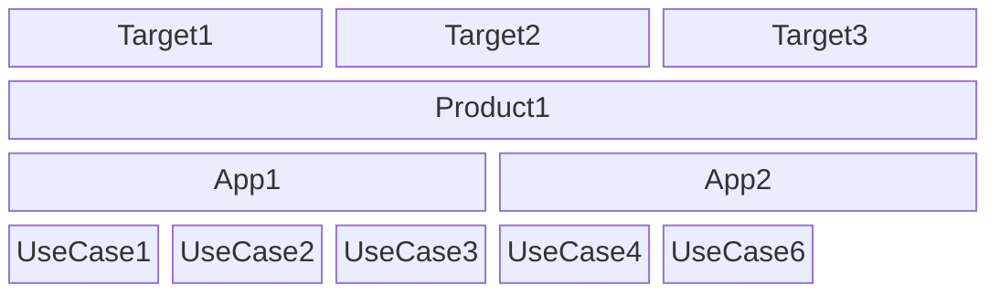
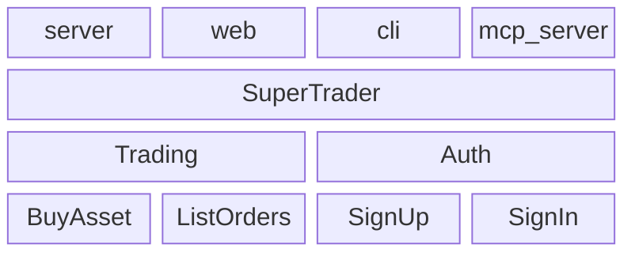

# libmodulor

An opinionated TypeScript library to create business oriented applications.

Applications created with `libmodulor` have **6 main properties** :

- Strictly typed with explicit business data types
- Fully typed e2e without code generation
- Auto documented
- Auto tested
- Multi platforms/runtimes
- Runnable anywhere

> [!WARNING]
> The project is still in active development. Although already used in pilot projects, it's not suitable for all production scenarios yet.
> Being developed by only one person, it may keep going for years or stop at any time.
> In the meantime, it's still a "research project" that needs improvement. Thus, it will be subject to BREAKING CHANGES as long as the version is not 1.0.0.

> [!NOTE]
> At the beginning, the whole documentation will be contained in this single file to make it easier to have the big picture and <kbd>cmd</kbd> + <kbd>F</kbd>. At some point, each section will move to a dedicated page. I'll even consider having a beautiful documentation website like all the cool kids.

All that said, the end goal is really to have a **production-grade library** to help everyone build **quality projects faster**. If you want to help in any way or have questions, feel free to contact me (cf. `author` in `package.json`).

## Philosophy

One might argue that, with so many "JS frameworks" on the market, there are already too many ways to build new applications today. And they would be right.

That's why the angle taken by `libmodulor` is different. Although opinionated about some things (see below), it is not, regarding the technical side. Instead, it focuses mainly on the "core" of your application.

Thus, you are free to use :

- the data store of your choice (PostgreSQL, MySQL, MariaDB, DynamoDB, SQLite, MongoDB...),
- the frontend framework of your choice (React, Svelte, Angular, Vue, Solid...),
- the server of your choice (Express, Fastify, Hono...),
- the meta framework of your choice (Next, Remix, Astro, Nuxt...),
- the runtime of your choice (Node, Deno, Bun...)
- the libraries of your choice (Lodash, React Query...)
- the tools of your choice (Biome, ESLint, Prettier...)
- the styling library of your choice for web (tailwind, shadcn, bootstrap, vanilla CSS...)
- the hosting of your choice (Cloud, IaaS, PaaS, On-Prem, RaspberryPi, your fridge...)

The main goal is to offer higher level primitives that make building business applications faster, without having to use a boilerplate or worse, no/low code, and thus, avoid vendor lock-in.

## How it works

The library defines a **4-layer architecture** composed of : `UseCase`, `App`, `Product`, `Target`.



_If you're not seeing the mermaid chart (e.g. on npm), head to GitHub._

### UseCase

A use case is the smallest unit. It defines the contract, mainly as an `Input` that goes into lifecycle methods (`client` and/or `server`) to finally give an `Output`. In the end, it constitutes a piece of business functionality.

Inspired by [UML's Use case diagram](https://en.wikipedia.org/wiki/Use_case_diagram) and [Event-driven architecture](https://en.wikipedia.org/wiki/Event-driven_architecture), schematically, it could be defined as follows :

```math
O = clientMain(serverMain(I))
```

_Examples : `SignIn`, `CreatePost`, `TransferAccount`, `InviteContacts`_...

Note how it always starts with a verb.

### App

An app is a logical group of use cases.

It's like a "module" (_whatever that means_), inspired by [Domain-driven design (DDD)](https://en.wikipedia.org/wiki/Domain-driven_design) bounded contexts.

_Examples : `Auth`, `Accounting`, `CMS`..._

### Product

A product is a logical group of apps that are assembled together.

Behind this barbaric definition, it's simply what end users know and use.

_Examples : `GitHub`, `Facebook`, `LinkedIn`, `Airbnb`..._

When defined correctly, apps are reusable across multiple products (e.g. `Auth`).

### Target

A target defines how a product is "exposed" to the end user. It's a combination of platform and runtime.

_Examples : `web-react`, `web-angular`, `server-node`, `cli-node`, `cli-stricli`..._

Note that it's the only place where the "infrastructure" choices are applied.

## Getting Started

Enough theory, let's dive in and learn by doing.

> [!NOTE]
> This Guide is voluntarily very verbose and not scripted so you can get a full overview of how things work. `npx` magic is good. But understanding what happens behind the scenes is good as well.

In this Guide, we'll init a repository (a repository can contain multiple apps and products) and create a real life application using the `libmodulor` primitives.

We'll build a small trading application. It will contain one `App` named `Trading`, which will contain one `UseCase` named `BuyAsset`. The `App` will be mounted in a `Product` called `SuperTrader` which will be exposed via a `server` `Target`, a `web` `Target`, a `cli` `Target` and finally, a `mcp-server` `Target`.

> [!NOTE]
> MCP stands for [Model Context Protocol](https://modelcontextprotocol.io) introduced recently by [@anthropics](https://github.com/anthropics).

If we adapt the abstract mermaid chart displayed above, concretely, it looks like this :



_If you're not seeing the mermaid chart (e.g. on npm), head to GitHub._

Note that we'll only develop one use case in this Guide but you get the idea.

Here are the steps we're going to follow.

1. [Create the project](./docs/getting-started/001_Create_the_project.md)
1. [Create the App](./docs/getting-started/002_Create_the_App.md)
1. [Create the UseCase](./docs/getting-started/003_Create_the_UseCase.md)
1. [Test the App](./docs/getting-started/004_Test_the_App.md)
1. [Create the Product](./docs/getting-started/005_Create_the_Product.md)
1. [Create the server Target](./docs/getting-started/006_Create_the_server_Target.md)
1. [Create the web Target](./docs/getting-started/007_Create_the_web_Target.md)
1. [Switch to a persistent data storage](./docs/getting-started/008_Switch_to_a_persistent_data_storage.md)
1. [Define wording for humans](./docs/getting-started/009_Define_wording_for_humans.md)
1. [Create the cli Target](./docs/getting-started/010_Create_the_cli_Target.md)
1. [Create the mcp-server Target](./docs/getting-started/011_Create_the_mcp_server_Target.md)
1. [Summary](./docs/getting-started/012_Summary.md)

Let's go with the first step : [Create the project](./docs/getting-started/001_Create_the_project.md).
