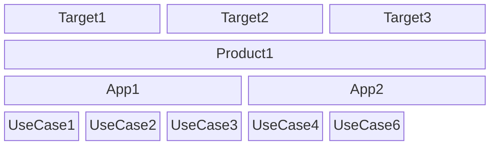

`libmodulor` defines a **4-layer architecture** composed of : `UseCase`, `App`, `Product`, `Target`.

Semantically,

- a `UseCase` is part of an `App`
- an `App` is mounted in a `Product`
- a `Product` is exposed via a `Target`
- a `Target` is installed/deployed somewhere



### UseCase

A use case is the smallest unit. It defines the contract, mainly as an `Input` that goes into lifecycle methods (`client` and/or `server`) to finally give an `Output`. In the end, it constitutes a piece of business functionality.

Inspired by [UML's Use case diagram](https://en.wikipedia.org/wiki/Use_case_diagram) and [Event-driven architecture](https://en.wikipedia.org/wiki/Event-driven_architecture), schematically, it could be defined as follows :

```math
O = clientMain(serverMain(I))
```

_Examples : `SignIn`, `CreatePost`, `TransferAccount`, `InviteContacts`_...

Note how it always starts with a verb.

Concretely, it's a file named `*UCD.ts` containing the definition of the use case (io, lifecycle, policies, etc.).

### App

An app is a logical group of use cases. It's like a "module" (_whatever that means_), inspired by [Domain-driven design (DDD)](https://en.wikipedia.org/wiki/Domain-driven_design) bounded contexts.

_Examples : `Auth`, `Accounting`, `CMS`..._

Concretely, it's a folder containing metadata files (`i18n.ts`, `manifest.ts`...) and a `ucds` folder which contains the use case definitions.

### Product

A product is a logical group of apps that are assembled together. It's simply what end users know and use.

_Examples : `GitHub`, `Facebook`, `LinkedIn`, `Airbnb`..._

Concretely, it's a folder containing  `i18n.ts`, `manifest.(js|ts)` and the elements corresponding to the desired targets. For example, it will contain the screens of a mobile app or the pages of a website.

### Target

A target defines how a product is "exposed" to the end user. It's a combination of platform and runtime.

_Examples : `web-react`, `web-angular`, `server-node`, `cli-node`, `cli-stricli`..._

Note that it's the only place where the "infrastructure" choices are applied. Targets can be generic and reusable across products.
