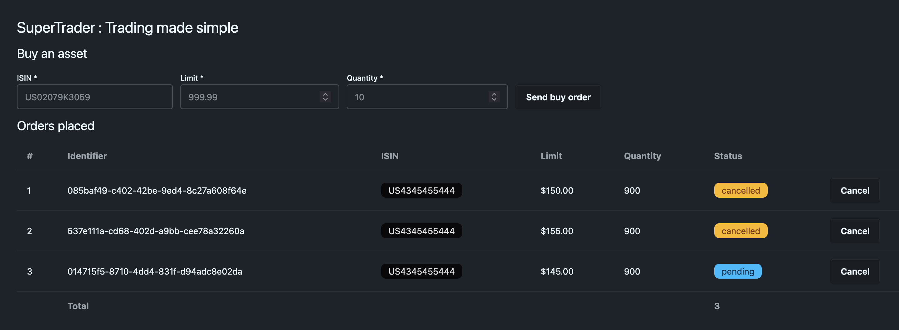
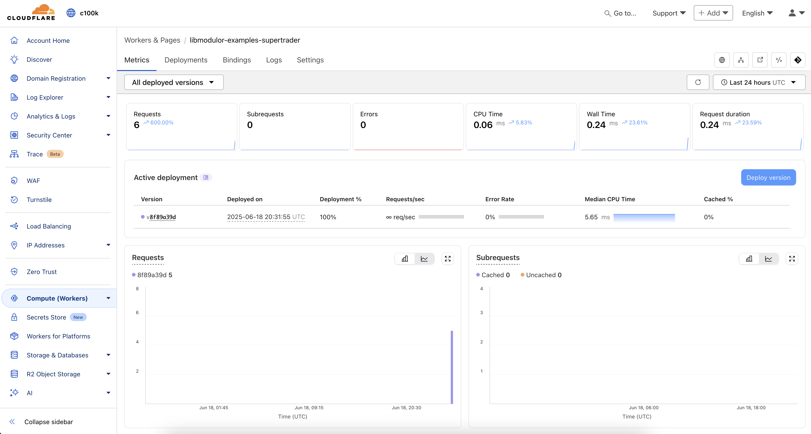
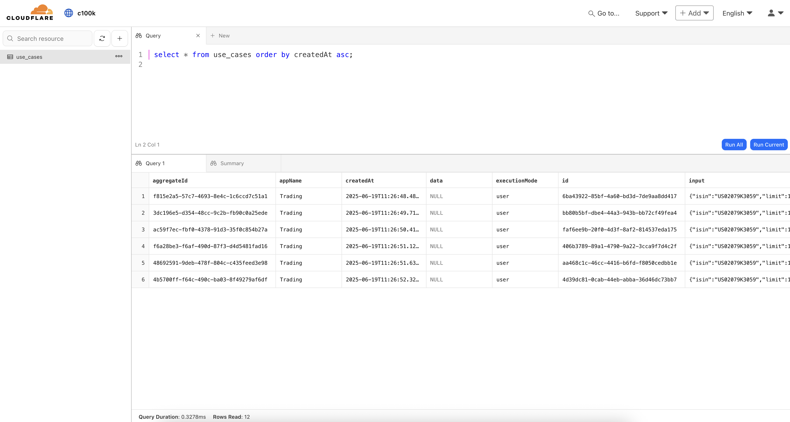

SuperTrader is a product featuring the `Trading` app with `BuyAssetUCD`, `CancelOrderUCD` and `ListOrdersUCD`, exposed on the following targets :

<Cards>
    <Card description="A Node.js / Express server" href="#server-node-express" title="server-node-express"  />
    <Card description="A React SPA (Single Page Application)" href="#spa" title="spa" />
    <Card description="A Node.js CLI" href="#cli" title="cli" />
    <Card description="A Local Node.js Stdio MCP Server running" href="#mcp-server" title="mcp-server" />
    <Card description="A React Native Android & iOS app" href="#rn" title="rn" />
    <Card description="A Node.js / Hono server" href="#server-node-hono" title="server-node-hono"  />
    <Card description="A Next.js server" href="#server-nextjs" title="server-nextjs"  />
    <Card description="A Cloudflare Worker" href="#server-cloudflare-worker" title="server-cloudflare-worker" />
</Cards>

## UseCases

Here are the sequence diagrams generated by the automatic documentation.

### BuyAsset


### CancelOrder


### ListOrders


## Get & Build

<Callout>
    Take the time to open the code in your favorite editor and browse it.
</Callout>

```sh
git clone git@github.com:c100k/libmodulor.git
cd libmodulor/examples/supertrader
pnpm install && touch .env && pnpm build
```

## Targets

### server-node-express

This target uses the built-in [`node-express-server`](https://github.com/c100k/libmodulor/tree/master/dist/esm/target/node-express-server) target,
is transpiled with [`tsc`](https://www.typescriptlang.org/docs/handbook/compiler-options.html)
and executed with [`Node.js`](https://nodejs.org).
It uses [`SQLite`](https://sqlite.org) as `UCDataStore`.

Start the server.

```sh
pnpm run:server-node-express
```

Test in your Terminal Emulator with `curl`.

```sh
# BuyAsset
curl -X POST -H "Content-Type: application/json" http://localhost:7443/api/v1/Trading_BuyAsset
# ❌ {"message":"Invalid credentials"}
curl -X POST -H "Content-Type: application/json" -H "X-API-Key: PublicApiKeyToBeChangedWhenDeploying" http://localhost:7443/api/v1/Trading_BuyAsset
# ❌ {"message":"ISIN must be filled"}
curl -X POST -H "Content-Type: application/json" -H "X-API-Key: PublicApiKeyToBeChangedWhenDeploying" -d '{"isin":"US02079K3059","limit":123.5,"qty":150}' http://localhost:7443/api/v1/Trading_BuyAsset
# ✅ {"parts":{"_0":{"items":[{"isin":"US02079K3059","id":"882f384b-fa46-424b-8b82-e0781ab1fbec","limit":123.5,"qty":150,"status":"pending"}],"total":1}}}

# CancelOrder
curl -X DELETE -H "Content-Type: application/json" -H "X-API-Key: PublicApiKeyToBeChangedWhenDeploying" -d '{"id":"882f384b-fa46-424b-8b82-e0781ab1fbec"}' http://localhost:7443/api/v1/Trading_CancelOrder
# ✅ {"parts":{"_0":{"items":[{"id":"a2285506-1afd-4649-98a6-e4443d1c6ce7","isin":"US02079K3059","limit":123.5,"qty":150,"status":"cancelled"}],"total":1}}}
curl -X DELETE -H "Content-Type: application/json" -H "X-API-Key: PublicApiKeyToBeChangedWhenDeploying" -d '{"id":"882f384b-fa46-424b-8b82-e0781ab1fbec"}' http://localhost:7443/api/v1/Trading_CancelOrder
# ❌ {"message":"Cannot cancel an order that is not pending"}

# ListOrders
curl -H "Content-Type: application/json" -H "X-API-Key: PublicApiKeyToBeChangedWhenDeploying" http://localhost:7443/api/v1/Trading_ListOrders
# ✅ {"parts":{"_0":{"items":[{"id":"a2285506-1afd-4649-98a6-e4443d1c6ce7","isin":"US02079K3059","limit":123.5,"qty":150,"status":"cancelled"}],"total":1}}}
```

<Callout>
    Keep your server running to test the "client" targets defined below.
</Callout>

### spa

This target uses the built-in [`react-web-pure`](https://github.com/c100k/libmodulor/tree/master/dist/esm/target/react-web-pure) target,
is bundled with [`vite`](https://vite.dev)
and uses custom components made with [`tailwindcss`](https://tailwindcss.com) & [`daisyUI`](https://daisyui.com).

It is statically served by the server defined above for convenience, but it could also be served by anything else (e.g. an S3 bucket, a simple nginx server and so on).

Test in your browser at http://localhost:7443.



### cli

This target uses the built-in [`node-core-cli`](https://github.com/c100k/libmodulor/tree/master/dist/esm/target/node-core-cli) target,
is transpiled with [`tsc`](https://www.typescriptlang.org/docs/handbook/compiler-options.html)
and executed with [`Node.js`](https://nodejs.org).

Test in your Terminal Emulator.

```sh
# BuyAsset
pnpm run:cli Trading_BuyAsset
# ❌ ISIN must be filled
pnpm run:cli Trading_BuyAsset --isin US02079K3059 --limit 123.5 --qty 150
# ✅ {"parts":{"_0":{"items":[{"isin":"US02079K3059","id":"c1ef95f1-f6e1-4616-a7a5-5584758b3a65","limit":123.5,"qty":150,"status":"pending"}],"total":1}}}

# CancelOrder
pnpm run:cli Trading_CancelOrder --id c1ef95f1-f6e1-4616-a7a5-5584758b3a65
# Are you sure ? [Y,y = Yes / N,n = Cancel] : y
# ✅ {"parts":{"_0":{"items":[{"id":"c1ef95f1-f6e1-4616-a7a5-5584758b3a65","isin":"US02079K3059","limit":123.5,"qty":150,"status":"cancelled"}],"total":1}}}
pnpm run:cli Trading_CancelOrder --id c1ef95f1-f6e1-4616-a7a5-5584758b3a65
# Are you sure ? [Y,y = Yes / N,n = Cancel] : y
# ❌ Cannot cancel an order that is not pending

# ListOrders
pnpm run:cli Trading_ListOrders
# ✅ {"parts":{"_0":{"items":[{"id":"a2285506-1afd-4649-98a6-e4443d1c6ce7","isin":"US02079K3059","limit":123.5,"qty":150,"status":"cancelled"},{"id":"882f384b-fa46-424b-8b82-e0781ab1fbec","isin":"US02079K3059","limit":123.5,"qty":150,"status":"pending"},{"id":"c1ef95f1-f6e1-4616-a7a5-5584758b3a65","isin":"US02079K3059","limit":123.5,"qty":150,"status":"cancelled"},{"id":"78509b91-0f33-43a2-b6e3-2ced5a1fa171","isin":"US02079K3059","limit":123.5,"qty":150,"status":"pending"}],"total":4}}}
```

### mcp-server

This target target uses the built-in [`node-mcp-server`](https://github.com/c100k/libmodulor/tree/master/dist/esm/target/node-mcp-server) target,
is transpiled with [`tsc`](https://www.typescriptlang.org/docs/handbook/compiler-options.html)
and exposes an `index.js` file to be used by the MCP client.

Test in [Claude Desktop](https://claude.ai/download).

Open the config file to register the MCP server.

```sh
nano ~/Library/Application\ Support/Claude/claude_desktop_config.json
```

Paste the following config and adapt the absolute path.

```json
{
    "mcpServers": {
        "libmodulor-supertrader": {
            "command": "node",
            "args": [
                "/ABSOLUTE_PATH_TO_THE_CWD/dist/products/SuperTrader/mcp-server/index.js"
            ]
        }
    }
}
```

Launch Claude Desktop.

At the bottom right of the prompt, you should see a little hammer 🔨 indicating `1 MCP Tool available`.

Click on it. You should see the use cases registered.

Write a prompt to buy an asset.

```txt
Dear Claude. Please buy 150 shares of Google.
```


### rn

This target uses the built-in [`react-native-pure`](https://github.com/c100k/libmodulor/tree/master/dist/esm/target/react-native-pure) target,
is bundled with [`expo`](https://expo.dev)
and runs on `android` and `ios`.

Make sure your [environment is setup](https://reactnative.dev/docs/environment-setup) to be able to use the Android Emulator and iOS Simulator (macOS only).

#### android

To call the server running on your machine, the Android emulator uses the special IP address `10.0.2.2`. Therefore, you need to restart you server to listen on `0.0.0.0`.

```sh
app_server_binding_host=0.0.0.0 pnpm run:server-node-express
```

Start the application on the android emulator.

```sh
pnpm run:rn:android
```

#### ios

Start the application on the ios simulator.

```sh
pnpm run:rn:ios
```


### server-node-hono

This target uses the built-in [`node-hono-server`](https://github.com/c100k/libmodulor/tree/master/dist/esm/target/node-hono-server) target.
It is very similar to `node-express-server`, except that it uses `hono` instead of `express`.
It also uses [`SQLite`](https://sqlite.org) as `UCDataStore`.

If the `node-express-server` is still running, stop it and start this one.

```sh
pnpm run:server-node-hono
```

You can test it the exact same way as above (with `curl` or the different clients).

### server-nextjs

This target uses the built-in [`server-nextjs`](https://github.com/c100k/libmodulor/tree/master/dist/esm/target/nextjs-server) target
and the same components as the `spa` target defined above. Except that they are served by [Next.js](https://nextjs.org).
It also uses [`SQLite`](https://sqlite.org) as `UCDataStore`.

```sh
pnpm run:server-nextjs
```

You can test it the exact same way as above (with `curl` or the different clients).
The only difference is that the server listens at port `3000` instead of `7443`.
Thus, you need to adapt it in the clients' `container.ts`. That's a good exercise to get used to the settings mechanism.

### server-cloudflare-worker

This target uses the built-in [`edge-worker-hono-server`](https://github.com/c100k/libmodulor/tree/master/dist/esm/target/edge-worker-hono-server) target in its `sync` flavor,
and is orchestrated with [`wrangler`](https://developers.cloudflare.com/workers/wrangler). It uses [Cloudflare D1](https://developers.cloudflare.com/d1) as `UCDataStore`.

<Callout>
    You need a Cloudflare account to test this target, even locally, as you need to create a D1 database.
    Please note that this might occur charges on your account.
</Callout>

Initialize the D1 database.

```sh
pnpm wrangler d1 create libmodulor-examples-supertrader-uc-data-store
pnpm wrangler d1 list
```

Add the binding in `dist/products/SuperTrader/server-cloudflare-worker/wrangler.jsonc` and adapt the `database_id`.

```json
"d1_databases": [
    {
        "binding": "UCDataStore",
        "database_id": "b9f07686-a54b-4850-b320-ccc97be69de6",
        "database_name": "libmodulor-examples-supertrader-uc-data-store"
    }
],
```

Apply the migrations to create the schema (`local` and `remote`).

```sh
pnpm wrangler d1 execute libmodulor-examples-supertrader-uc-data-store --cwd ./dist/products/SuperTrader/server-cloudflare-worker --local --file=./migrations/001_init.sql
pnpm wrangler d1 execute libmodulor-examples-supertrader-uc-data-store --cwd ./dist/products/SuperTrader/server-cloudflare-worker --remote --file=./migrations/001_init.sql
```

Start the server locally.

```sh
pnpm run:server-cloudflare-worker
```

You can test it the exact same way as above (with `curl` or the different clients).
The only difference is that the server listens at port `8787` (or a random one assigned by wrangler) instead of `7443`.
Thus, you need to adapt it in the clients' `container.ts`. That's a good exercise to get used to the settings mechanism.

You can even deploy it on your account.

```sh
pnpm deploy:server-cloudflare-worker
```

Once done, perform the exact same tests as above, simply by replacing the local address and port by the remote one.

You can inspect the requests in the Cloudflare `Workers & Pages` dashboard as shown below.



## Explore the data

### SQLite

The `server-node-express`, `server-node-hono` and `server-nextjs` targets rebind the `UCDataStore` from `InMemoryUCDataStore` (default) to `KnexUCDataStore` configured with [`SQLite`](https://sqlite.org).

Therefore, if you have executed the use cases via any of the targets above, you can explore the data in the DB file.

```sh
open uc-data-store.sqlite
```


### Cloudflare D1

The `server-cloudflare-worker` target rebinds `UCDataStore` from `InMemoryUCDataStore` (default) to `CloudflareD1UCDataStore`.

Therefore, if you have executed the use cases via any of the targets above, you can explore the data locally and remotely.

For local data, open the [`SQLite`](https://sqlite.org) file stored at `dist/products/SuperTrader/server-cloudflare-worker/.wrangler/state/v3/d1/miniflare-D1DatabaseObject/`.

For remote data, open the Cloudflare `D1` dashboard as shown below.


