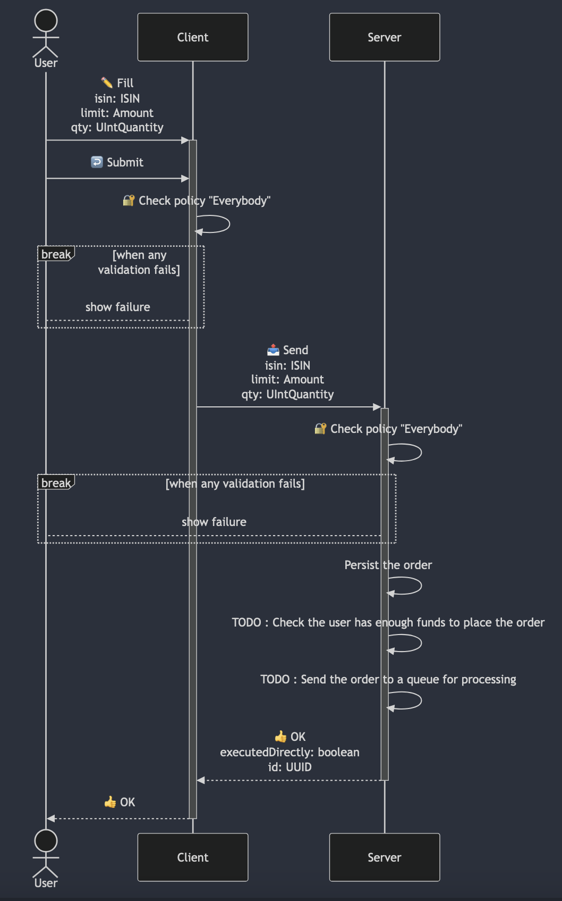
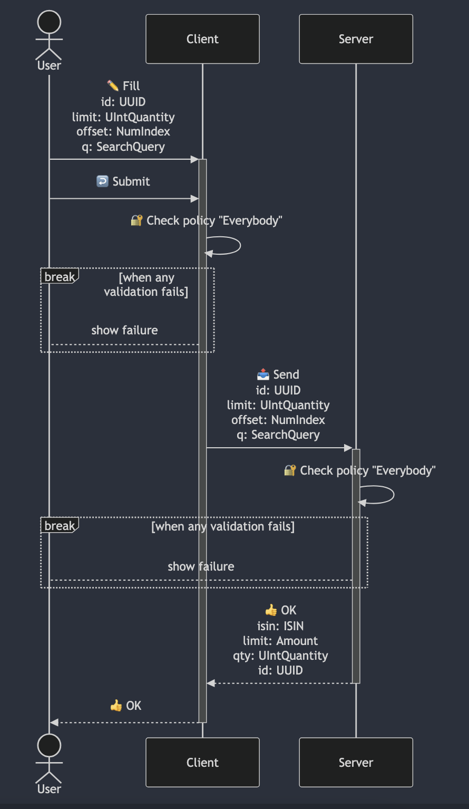
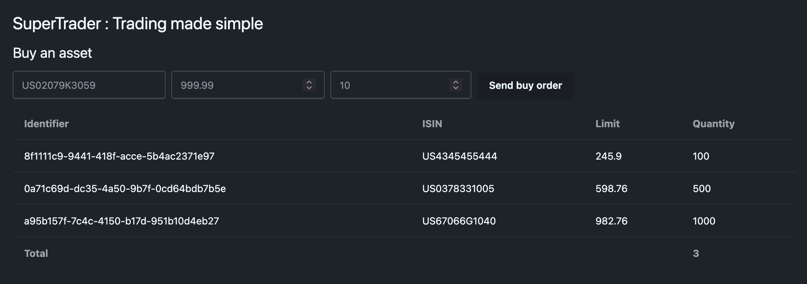
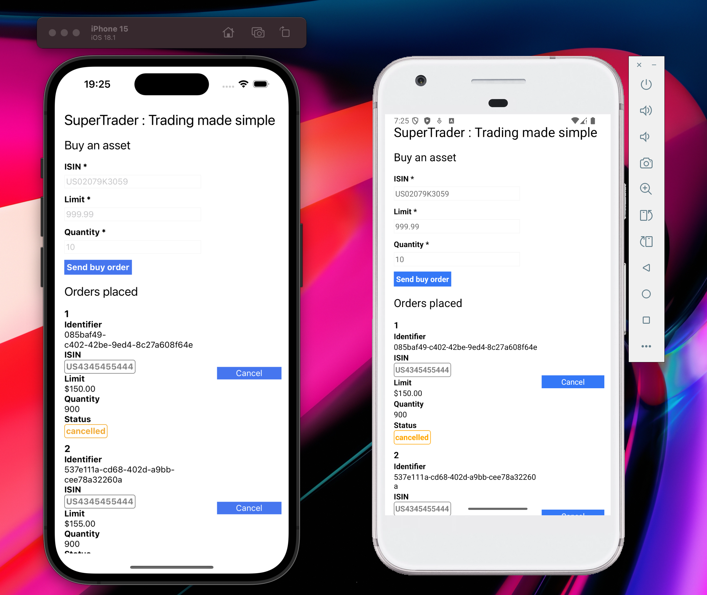

SuperTrader is a product featuring the `Trading` app with `BuyAssetUCD`, `CancelOrderUCD` and `ListOrdersUCD`, exposed on the following targets :

<Cards>
    <Card description="Server running with Node.js and Express" href="#server-node-express" title="server-node-express"  />
    <Card description="SPA running with React" href="#web" title="web" />
    <Card description="Command Line Interface running with Node.js" href="#cli" title="cli" />
    <Card description="Local Stdio MCP Server running with Node.js" href="#mcp-server" title="mcp-server" />
    <Card description="Android & iOS mobile app" href="#rn" title="rn" />
    <Card description="Server running with Node.js and Hono" href="#server-node-hono" title="server-node-hono"  />
    <Card description="Server running with Next.js" href="#server-nextjs" title="server-nextjs"  />
</Cards>

## UseCases

Here are the sequence diagram generated by the automatic documentation.

### BuyAsset



### CancelOrder


### ListOrders



## Get & Build

<Callout>
    Take the time to open the code in your favorite editor and browse it.
</Callout>

```sh
git clone git@github.com:c100k/libmodulor.git
cd libmodulor/examples/supertrader
yarn install && touch .env && yarn build
```

## Targets

### server-node-express

The `server-node-express` target uses the built-in `node-express-server` target, is transpiled with `tsc` and executed with `node`. It uses SQLite as `UCDataStore`.

```sh
yarn run:server-node-express
```

Test in your Terminal Emulator with `curl`.

```sh
# BuyAsset
curl -X POST -H "Content-Type: application/json" http://localhost:7443/api/v1/Trading_BuyAsset
# ❌ {"message":"Invalid credentials"}
curl -X POST -H "Content-Type: application/json" -H "X-API-Key: PublicApiKeyToBeChangedWhenDeploying" http://localhost:7443/api/v1/Trading_BuyAsset
# ❌ {"message":"ISIN must be filled"}
curl -X POST -H "Content-Type: application/json" -H "X-API-Key: PublicApiKeyToBeChangedWhenDeploying" -d '{"isin":"US02079K3059","limit":123.5,"qty":150}' http://localhost:7443/api/v1/Trading_BuyAsset
# ✅ {"parts":{"_0":{"items":[{"isin":"US02079K3059","id":"882f384b-fa46-424b-8b82-e0781ab1fbec","limit":123.5,"qty":150,"status":"pending"}],"total":1}}}

# CancelOrder
curl -X DELETE -H "Content-Type: application/json" -H "X-API-Key: PublicApiKeyToBeChangedWhenDeploying" -d '{"id":"882f384b-fa46-424b-8b82-e0781ab1fbec"}' http://localhost:7443/api/v1/Trading_CancelOrder
# ✅ {"parts":{"_0":{"items":[{"id":"a2285506-1afd-4649-98a6-e4443d1c6ce7","isin":"US02079K3059","limit":123.5,"qty":150,"status":"cancelled"}],"total":1}}}
curl -X DELETE -H "Content-Type: application/json" -H "X-API-Key: PublicApiKeyToBeChangedWhenDeploying" -d '{"id":"882f384b-fa46-424b-8b82-e0781ab1fbec"}' http://localhost:7443/api/v1/Trading_CancelOrder
# ❌ {"message":"Cannot cancel an order that is not pending"}

# ListOrders
curl -H "Content-Type: application/json" -H "X-API-Key: PublicApiKeyToBeChangedWhenDeploying" http://localhost:7443/api/v1/Trading_ListOrders
# ✅ {"parts":{"_0":{"items":[{"id":"a2285506-1afd-4649-98a6-e4443d1c6ce7","isin":"US02079K3059","limit":123.5,"qty":150,"status":"cancelled"}],"total":1}}}
```

<Callout>
    Keep your server running to test the "client" targets defined below.
</Callout>

### web

The `web` target uses the built-in `react-web-pure` target, is bundled with `vite` and uses custom components made with `tailwindcss@v4` & `daisyUI@v5`.

It is served as a SPA by the server defined above.

Test in your browser at http://localhost:7443.



### cli

The `cli` target uses the built-in `node-core-cli` target, is transpiled with `tsc` and executed with `node`.

Test in your Terminal Emulator.

```sh
# BuyAsset
yarn run:cli Trading_BuyAsset
# ❌ ISIN must be filled
yarn run:cli Trading_BuyAsset --isin US02079K3059 --limit 123.5 --qty 150
# ✅ {"parts":{"_0":{"items":[{"isin":"US02079K3059","id":"c1ef95f1-f6e1-4616-a7a5-5584758b3a65","limit":123.5,"qty":150,"status":"pending"}],"total":1}}}

# CancelOrder
yarn run:cli Trading_CancelOrder --id c1ef95f1-f6e1-4616-a7a5-5584758b3a65
# Are you sure ? [Y,y = Yes / N,n = Cancel] : y
# ✅ {"parts":{"_0":{"items":[{"id":"c1ef95f1-f6e1-4616-a7a5-5584758b3a65","isin":"US02079K3059","limit":123.5,"qty":150,"status":"cancelled"}],"total":1}}}
yarn run:cli Trading_CancelOrder --id c1ef95f1-f6e1-4616-a7a5-5584758b3a65
# Are you sure ? [Y,y = Yes / N,n = Cancel] : y
# ❌ Cannot cancel an order that is not pending

# ListOrders
yarn run:cli Trading_ListOrders
# ✅ {"parts":{"_0":{"items":[{"id":"a2285506-1afd-4649-98a6-e4443d1c6ce7","isin":"US02079K3059","limit":123.5,"qty":150,"status":"cancelled"},{"id":"882f384b-fa46-424b-8b82-e0781ab1fbec","isin":"US02079K3059","limit":123.5,"qty":150,"status":"pending"},{"id":"c1ef95f1-f6e1-4616-a7a5-5584758b3a65","isin":"US02079K3059","limit":123.5,"qty":150,"status":"cancelled"},{"id":"78509b91-0f33-43a2-b6e3-2ced5a1fa171","isin":"US02079K3059","limit":123.5,"qty":150,"status":"pending"}],"total":4}}}
```

### mcp-server

The `mcp-server` target uses the built-in `node-mcp-server` target, is transpiled with `tsc` and exposes an `index.js` file to be used by the MCP client.

Test in [Claude Desktop](https://claude.ai/download).

Register the MCP server by copy/pasting the following config, adapting the absolute path with `pwd`.

```sh
nano ~/Library/Application\ Support/Claude/claude_desktop_config.json
```

```json
{
    "mcpServers": {
        "libmodulor-supertrader": {
            "command": "node",
            "args": [
                "/ABSOLUTE_PATH_TO_THE_CWD/dist/products/SuperTrader/mcp-server/index.js"
            ]
        }
    }
}
```

Launch Claude Desktop.

At the bottom right of the prompt you should see a little hammer 🔨 indicating `1 MCP Tool available`.

Click on it. You should see the `Trading_BuyAsset` use case registered.

Write a prompt to buy an asset.

```txt
Dear Claude. Please buy 150 shares of Google.
```


### rn

The `rn` target uses the built-in `react-native-pure` target, is bundled with `expo` so it can run on `android` and `ios`.

Make sure your [environment is setup](https://reactnative.dev/docs/environment-setup) to be able to use the Android Emulator and iOS Simulator (macOS only).

```sh
yarn run:rn:android
yarn run:rn:ios
```



### server-node-hono

The `server-node-hono` is the same as `server-node-express` defined above, except that it's using `hono` instead of `express`.

```sh
yarn run:server-node-hono
```

You can go back to all the client targets and run them. It will work the exact same way.

### server-nextjs

The `server-nextjs` target uses the built-in `server-nextjs` target and the same components as the `web` target defined above.

```sh
yarn run:server-nextjs
```

Test in your browser at http://localhost:3000.

## Inspect UCDataStore

The `server-*` targets rebinds the `UCDataStore` from in memory (default) to `KnexUCDataStore` configured for SQLite.

Therefore, if you have executed the use case via the targets above, you can see the data in the DB file.

```sh
open dist/products/SuperTrader/server-node-express/uc-data-store.sqlite
open dist/products/SuperTrader/server-node-hono/uc-data-store.sqlite
open dist/products/SuperTrader/server-nextjs/uc-data-store.sqlite
```


