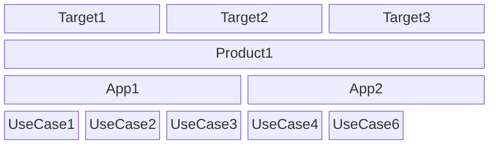

# 📖 Introduction

## 📚 Philosophy

One might argue that, with so many "JS frameworks" on the market, there are already too many ways to build new applications today. And they would be right.

That's why the angle taken by `libmodulor` is different. Although opinionated about some things (see below), it is not, regarding the technical side. Instead, it focuses mainly on the "core" of your application.

Thus, you are free to use :

- the data store of your choice (PostgreSQL, MySQL, MariaDB, DynamoDB, SQLite, MongoDB...),
- the frontend framework of your choice (React, Svelte, Angular, Vue, Solid...),
- the server of your choice (Express, Fastify, Hono...),
- the meta framework of your choice (Next, Remix, Astro, Nuxt...),
- the runtime of your choice (Node, Deno, Bun...)
- the libraries of your choice (Lodash, React Query...)
- the tools of your choice (Biome, ESLint, Prettier...)
- the styling library of your choice for web (tailwind, shadcn, bootstrap, vanilla CSS...)
- the hosting of your choice (Cloud, IaaS, PaaS, On-Prem, RaspberryPi, your fridge...)

The main goal is to offer higher level primitives that make building business applications faster, without having to use a boilerplate or worse, no/low code, and thus, avoid vendor lock-in.

## 🏛️ Architecture

`libmodulor` defines a **4-layer architecture** composed of : `UseCase`, `App`, `Product`, `Target`.

Semantically,

- a `UseCase` is part of an `App`
- an `App` is mounted in a `Product`
- a `Product` is exposed via a `Target`
- a `Target` is installed/deployed somewhere



### UseCase

A use case is the smallest unit. It defines the contract, mainly as an `Input` that goes into lifecycle methods (`client` and/or `server`) to finally give an `Output`. In the end, it constitutes a piece of business functionality.

Inspired by [UML's Use case diagram](https://en.wikipedia.org/wiki/Use_case_diagram) and [Event-driven architecture](https://en.wikipedia.org/wiki/Event-driven_architecture), schematically, it could be defined as follows :

```math
O = clientMain(serverMain(I))
```

_Examples : `SignIn`, `CreatePost`, `TransferAccount`, `InviteContacts`_...

Note how it always starts with a verb.

Concretely, it's a file named `*UCD.ts` containing the definition of the use case (io, lifecycle, policies, etc.).

### App

An app is a logical group of use cases. It's like a "module" (_whatever that means_), inspired by [Domain-driven design (DDD)](https://en.wikipedia.org/wiki/Domain-driven_design) bounded contexts.

_Examples : `Auth`, `Accounting`, `CMS`..._

Concretely, it's a folder containing metadata files (`i18n.ts`, `manifest.ts`...) and a `ucds` folder which contains the use case definitions.

### Product

A product is a logical group of apps that are assembled together. It's simply what end users know and use.

_Examples : `GitHub`, `Facebook`, `LinkedIn`, `Airbnb`..._

Concretely, it's a folder containing  `i18n.ts`, `manifest.(js|ts)` and the elements corresponding to the desired targets. For example, it will contain the screens of a mobile app or the pages of a website.

### Target

A target defines how a product is "exposed" to the end user. It's a combination of platform and runtime.

_Examples : `web-react`, `web-angular`, `server-node`, `cli-node`, `cli-stricli`..._

Note that it's the only place where the "infrastructure" choices are applied. Targets can be generic and reusable across products.

## 👀 At a glance

As developers, we love to see code. So here is what a typical use case looks like.

```typescript
import { UCInput, /* omitted for brevity */ } from 'libmodulor';
import { Manifest } from '../manifest.js';
import { SignInServerMain } from './SignInServerMain.js';

export interface SignInInput extends UCInput {
    email: UCInputFieldValue<Email>;
    password: UCInputFieldValue<Password>;
}

export interface SignInOPI0 extends UCOPIBase {
    jwt: JWT;
}

export const SignInUCD: UCDef<SignInInput, SignInOPI0> = {
    io: {
        i: {
            fields: {
                email: {
                    type: new TEmail(),
                },
                password: {
                    type: new TPassword({ minLength: 10 }),
                },
            },
        },
        o: {
            parts: {
                _0: {
                    fields: {
                        jwt: {
                            type: new TJWT(),
                        },
                    },
                },
            },
        },
    },
    lifecycle: {
        client: {
            main: SendClientMain,
            policy: AnonymousUCPolicy,
        },
        server: {
            main: SignInServerMain,
            policy: AnonymousUCPolicy,
        },
    },
    metadata: Manifest.ucReg.SignIn,
};
```
