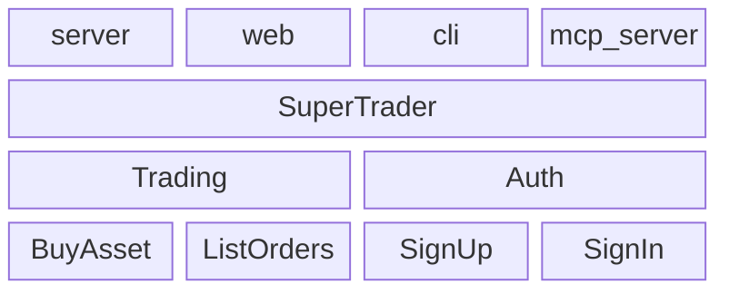

# 🚀 Tutorial

> [!NOTE]
> This Tutorial is voluntarily very verbose and not scripted so you can get a full overview of how things work.

First, we'll init the project repository using `npx` (a repository can contain multiple apps and products).

Then, we'll build a small trading application. It will contain one `App` named `Trading`, which will contain one `UseCase` named `BuyAsset`. The `App` will be mounted in a `Product` called `SuperTrader` which will be exposed via a `server`, `web`, `cli`, `mcp-server` and `rn` `Targets`.

When we adapt the abstract mermaid chart shown in the introduction, concretely, it looks like this :

Note that we'll develop only one use case to keep the Tutorial straightforward. Hopefully you'll get onboarded quickly and will build all the others by yourself.

Here are the steps we're going to follow. Don't worry. Even though it seems a lot, it will be super quick, efficient and straight to the point.

1. [Create the project](./tutorial/001_Create_the_project.md)
1. [Create the App](./tutorial/002_Create_the_App.md)
1. [Create the UseCase](./tutorial/003_Create_the_UseCase.md)
1. [Test the App](./tutorial/004_Test_the_App.md)
1. [Create the Product](./tutorial/005_Create_the_Product.md)
1. [Expose the server Target](./tutorial/006_Expose_the_server_Target.md)
1. [Expose the web Target](./tutorial/007_Expose_the_web_Target.md)
1. [Switch to a persistent data storage](./tutorial/008_Switch_to_a_persistent_data_storage.md)
1. [Define wording for humans](./tutorial/009_Define_wording_for_humans.md)
1. [Expose the cli Target](./tutorial/010_Expose_the_cli_Target.md)
1. [Expose the mcp-server Target](./tutorial/011_Expose_the_mcp_server_Target.md)
1. [Expose the rn Target](./tutorial/012_Expose_the_rn_Target.md)
1. [Style the web Target](./tutorial/013_Style_the_web_Target.md)
1. [Summary](./tutorial/030_Summary.md)

Let's go with the first step : [Create the project](./tutorial/001_Create_the_project.md).
