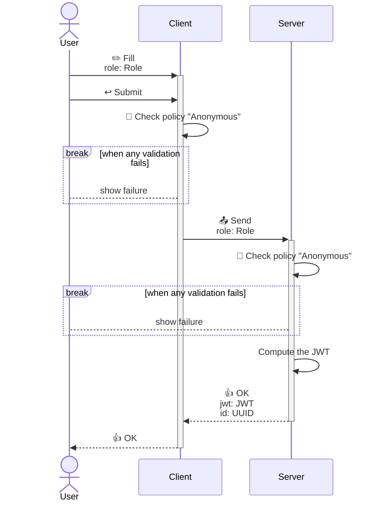
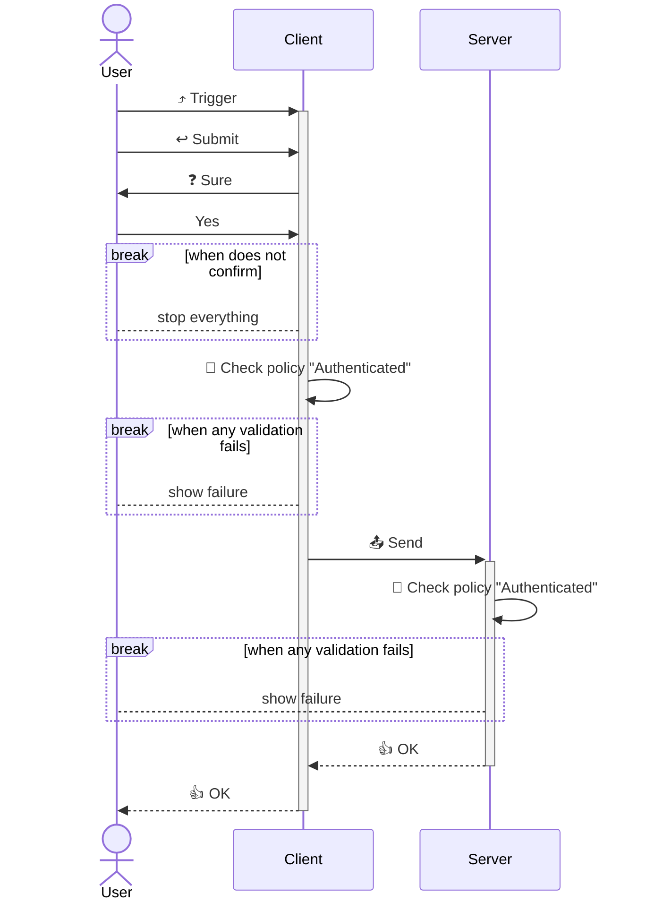
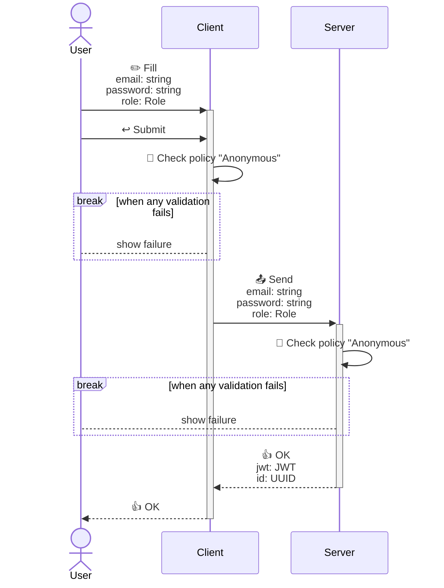

<!---
    All this code has been auto generated.
    DO NOT EDIT.
    Or be prepared to see all your changes erased at the next generation.
-->

# App

## Use Cases

### SignIn

- **Type** : `Client / Server`
- **Client Policy** : `Anonymous`
- **Server Policy** : `Anonymous`

#### Input (I)

|#|name|humanized|dataType|
|---|---|---|---|
|1|`role`|Role|`Role`|

#### Output (O)

##### Part 0 (OPI0)

|#|name|humanized|dataType|
|---|---|---|---|
|1|`jwt`|Jwt|`JWT`|
|2|`id`|Id|`UUID`|

##### Part 1 (OPI1)

None

#### Sequence Diagram

```mermaid
sequenceDiagram
    actor User
    User->>+Client: ✏️ Fill<br/>role: Role
    User->>Client: ↩️ Submit
    Client->>Client: 🔐 Check policy "Anonymous"
    break when any validation fails
        Client-->User: show failure
    end
    Client->>+Server: 📤 Send<br/>role: Role
    Server->>Server: 🔐 Check policy "Anonymous"
    break when any validation fails
        Server-->User: show failure
    end
    Server->>Server: Compute the JWT
    Server-->>-Client: 👍 OK<br/>jwt: JWT<br/>id: UUID
    Client-->>-User: 👍 OK
```

### SignOut

- **Type** : `Client / Server`
- **Client Policy** : `Authenticated`
- **Server Policy** : `Authenticated`

#### Input (I)

None

#### Output (O)

##### Part 0 (OPI0)

None

##### Part 1 (OPI1)

None

#### Sequence Diagram

```mermaid
sequenceDiagram
    actor User
    User->>+Client: ⤴️ Trigger
    User->>Client: ↩️ Submit
    Client->>User: ❓ Sure
    User->>Client: Yes
    break when does not confirm
        Client-->User: stop everything
    end
    Client->>Client: 🔐 Check policy "Authenticated"
    break when any validation fails
        Client-->User: show failure
    end
    Client->>+Server: 📤 Send
    Server->>Server: 🔐 Check policy "Authenticated"
    break when any validation fails
        Server-->User: show failure
    end
    Server-->>-Client: 👍 OK
    Client-->>-User: 👍 OK
```

### SignUp

- **Type** : `Client / Server`
- **Client Policy** : `Anonymous`
- **Server Policy** : `Anonymous`

#### Input (I)

|#|name|humanized|dataType|
|---|---|---|---|
|1|`email`|Email|`string`|
|2|`password`|Password|`string`|
|3|`role`|Role|`Role`|

#### Output (O)

##### Part 0 (OPI0)

|#|name|humanized|dataType|
|---|---|---|---|
|1|`jwt`|Jwt|`JWT`|
|2|`id`|Id|`UUID`|

##### Part 1 (OPI1)

None

#### Sequence Diagram

```mermaid
sequenceDiagram
    actor User
    User->>+Client: ✏️ Fill<br/>email: string<br/>password: string<br/>role: Role
    User->>Client: ↩️ Submit
    Client->>Client: 🔐 Check policy "Anonymous"
    break when any validation fails
        Client-->User: show failure
    end
    Client->>+Server: 📤 Send<br/>email: string<br/>password: string<br/>role: Role
    Server->>Server: 🔐 Check policy "Anonymous"
    break when any validation fails
        Server-->User: show failure
    end
    Server-->>-Client: 👍 OK<br/>jwt: JWT<br/>id: UUID
    Client-->>-User: 👍 OK
```

## Technical Summary

|#|filePath|constName|metadataName|metadataAction|metadataBeta|metadataIcon|metadataNew|metadataSensitive|externalImports|internalImports|ioI|ioIFields|ioOPI0|ioOPI0Fields|ioOPI1|ioOPI1Fields|lifecycleClientPolicy|lifecycleServerPolicy|
|---|---|---|---|---|---|---|---|---|---|---|---|---|---|---|---|---|---|---|
|1|/src/ucds/SignInUCD.ts|SignInUCD|SignIn|Create||right-to-bracket||||../../../../../dist/esm/index.js ../lib/TRole.js ../manifest.js ./SignInServerMain.js|SignInInput|role: UCInputFieldValue&#60;Role&#62;|SignInOPI0|jwt: JWT id: UUID|||Anonymous|Anonymous|
|2|/src/ucds/SignOutUCD.ts|SignOutUCD|SignOut|Delete||circle-xmark||true||../../../../../dist/esm/index.js ../manifest.js|||||||Authenticated|Authenticated|
|3|/src/ucds/SignUpUCD.ts|SignUpUCD|SignUp|Create||user-plus||||../../../../../dist/esm/index.js ../lib/TRole.js ../manifest.js ./SignUpServerMain.js|SignUpInput|email: UCInputFieldValue&#60;string&#62; password: UCInputFieldValue&#60;string&#62; role: UCInputFieldValue&#60;Role&#62;|SignUpOPI0|jwt: JWT id: UUID|||Anonymous|Anonymous|
