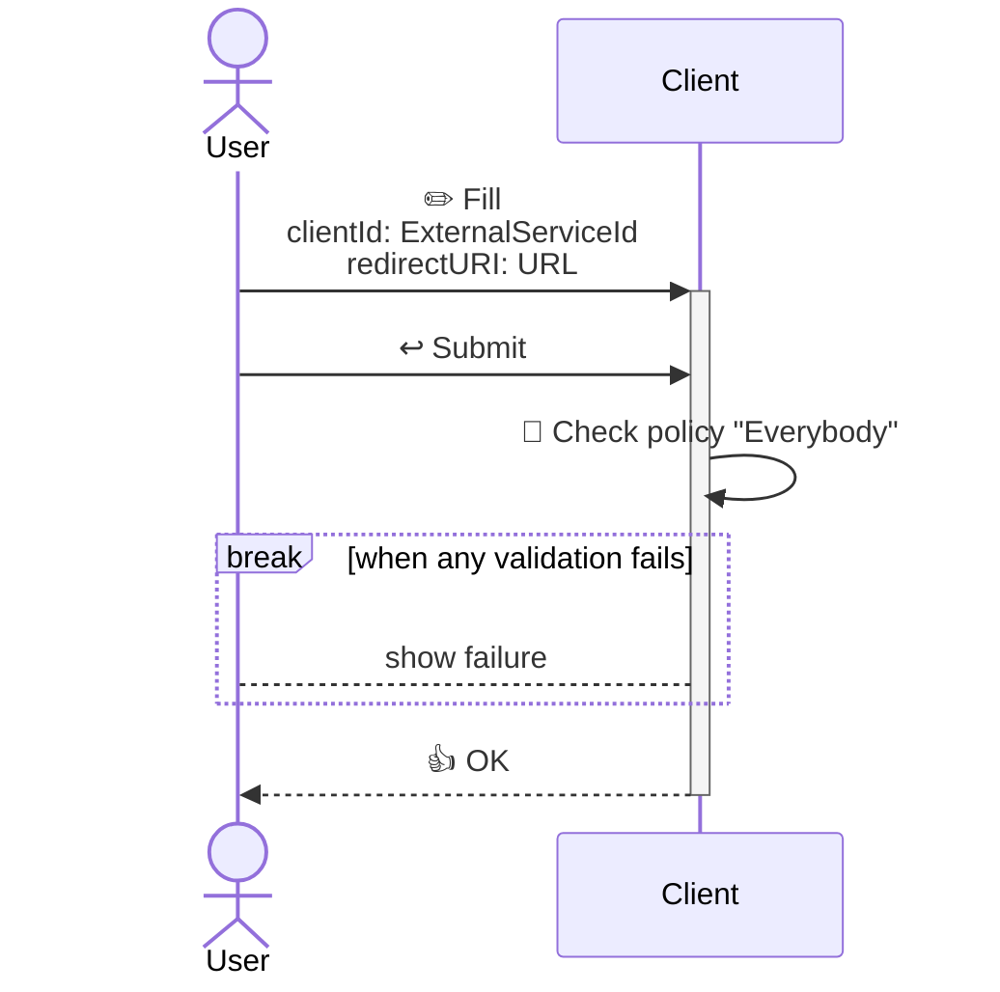
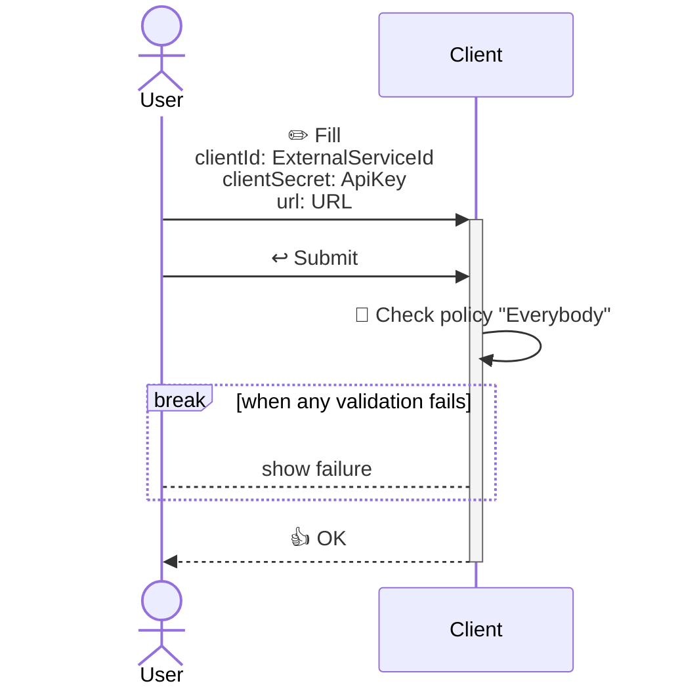
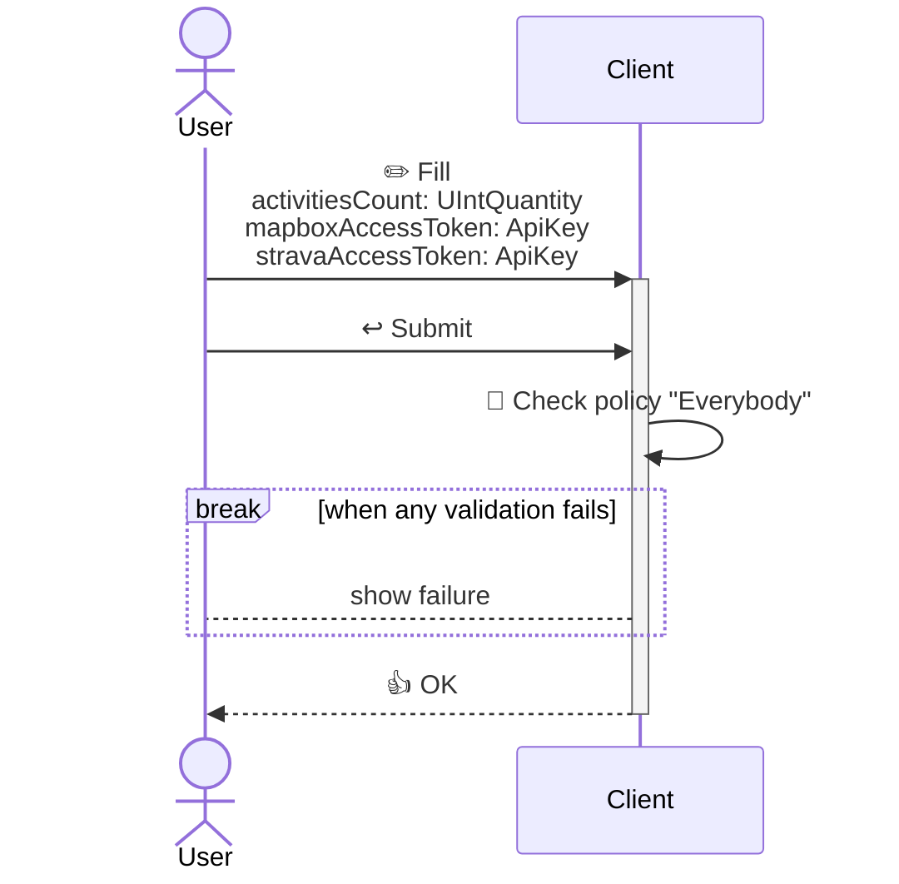

<!---
    All this code has been auto generated.
    DO NOT EDIT.
    Or be prepared to see all your changes erased at the next generation.
-->

# App

## Use Cases

### AuthenticateToStravaStep1

### AuthenticateToStravaStep2

### GenerateRunningMapFromStrava

## Technical Summary

|#|filePath|constName|metadataName|metadataAction|metadataBeta|metadataIcon|metadataNew|metadataSensitive|externalImports|internalImports|ioI|ioIFields|ioOPI0|ioOPI0Fields|ioOPI1|ioOPI1Fields|lifecycleClientPolicy|lifecycleServerPolicy|
|---|---|---|---|---|---|---|---|---|---|---|---|---|---|---|---|---|---|---|
|1|/src/ucds/AuthenticateToStravaStep1UCD.ts|AuthenticateToStravaStep1UCD|AuthenticateToStravaStep1|Create||right-to-bracket|||inversify|../../../../../dist/esm/index.js ../lib/link/LinkManager.js ../manifest.js|AuthenticateToStravaStep1Input|clientId: UCInputFieldValue&#60;ExternalServiceId&#62; redirectURI: UCInputFieldValue&#60;URL&#62;|||||Everybody||
|2|/src/ucds/AuthenticateToStravaStep2UCD.ts|AuthenticateToStravaStep2UCD|AuthenticateToStravaStep2|Create||right-to-bracket|||inversify|../../../../../dist/esm/index.js ../manifest.js|AuthenticateToStravaStep2Input|clientId: UCInputFieldValue&#60;ExternalServiceId&#62; clientSecret: UCInputFieldValue&#60;ApiKey&#62; url: UCInputFieldValue&#60;URL&#62;|AuthenticateToStravaStep2OPI0|accessToken: ApiKey id: UUID|||Everybody||
|3|/src/ucds/GenerateRunningMapFromStravaUCD.ts|GenerateRunningMapFromStravaUCD|GenerateRunningMapFromStrava|Create||map|||inversify|../../../../../dist/esm/index.js ../lib/geospatial/GeospatialManager.js ../manifest.js|GenerateRunningMapFromStravaInput|activitiesCount: UCInputFieldValue&#60;UIntQuantity&#62; mapboxAccessToken: UCInputFieldValue&#60;ApiKey&#62; stravaAccessToken: UCInputFieldValue&#60;ApiKey&#62;|GenerateRunningMapFromStravaOPI0|mapURL: URLString mapURLCharsCount: UIntQuantity id: UUID|||Everybody||
