<!---
    All this code has been auto generated.
    DO NOT EDIT.
    Or be prepared to see all your changes erased at the next generation.
-->

# App

## Use Cases

### AuthenticateToStravaStep1

- **Type** : `Client only`
- **Client Policy** : `Everybody`
- **Server Policy** : -

#### Input (I)

|#|name|humanized|dataType|
|---|---|---|---|
|1|`clientId`|Client Id|`ExternalServiceId`|
|2|`redirectURI`|Redirect URI|`URL`|

#### Output (O)

##### Part 0 (OPI0)

None

##### Part 1 (OPI1)

None

#### Sequence Diagram

```mermaid
sequenceDiagram
    actor User
    User->>+Client: ✏️ Fill<br/>clientId: ExternalServiceId<br/>redirectURI: URL
    User->>Client: ↩️ Submit
    Client->>Client: 🔐 Check policy "Everybody"
    break when any validation fails
        Client-->User: show failure
    end
    Client-->>-User: 👍 OK
```

### AuthenticateToStravaStep2

- **Type** : `Client only`
- **Client Policy** : `Everybody`
- **Server Policy** : -

#### Input (I)

|#|name|humanized|dataType|
|---|---|---|---|
|1|`clientId`|Client Id|`ExternalServiceId`|
|2|`clientSecret`|Client Secret|`ApiKey`|
|3|`url`|Url|`URL`|

#### Output (O)

##### Part 0 (OPI0)

|#|name|humanized|dataType|
|---|---|---|---|
|1|`accessToken`|Access Token|`ApiKey`|
|2|`id`|Id|`UUID`|

##### Part 1 (OPI1)

None

#### Sequence Diagram

### GenerateRunningMapFromStrava

- **Type** : `Client only`
- **Client Policy** : `Everybody`
- **Server Policy** : -

#### Input (I)

|#|name|humanized|dataType|
|---|---|---|---|
|1|`activitiesCount`|Activities Count|`UIntQuantity`|
|2|`mapboxAccessToken`|Mapbox Access Token|`ApiKey`|
|3|`stravaAccessToken`|Strava Access Token|`ApiKey`|

#### Output (O)

##### Part 0 (OPI0)

|#|name|humanized|dataType|
|---|---|---|---|
|1|`mapURL`|Map URL|`URLString`|
|2|`mapURLCharsCount`|Map URLChars Count|`UIntQuantity`|
|3|`id`|Id|`UUID`|

##### Part 1 (OPI1)

None

#### Sequence Diagram

```mermaid
sequenceDiagram
    actor User
    User->>+Client: ✏️ Fill<br/>activitiesCount: UIntQuantity<br/>mapboxAccessToken: ApiKey<br/>stravaAccessToken: ApiKey
    User->>Client: ↩️ Submit
    Client->>Client: 🔐 Check policy "Everybody"
    break when any validation fails
        Client-->User: show failure
    end
    Client-->>-User: 👍 OK
```

## Technical Summary

|#|filePath|constName|metadataName|metadataAction|metadataBeta|metadataIcon|metadataNew|metadataSensitive|externalImports|internalImports|ioI|ioIFields|ioOPI0|ioOPI0Fields|ioOPI1|ioOPI1Fields|lifecycleClientPolicy|lifecycleServerPolicy|
|---|---|---|---|---|---|---|---|---|---|---|---|---|---|---|---|---|---|---|
|1|/src/ucds/AuthenticateToStravaStep1UCD.ts|AuthenticateToStravaStep1UCD|AuthenticateToStravaStep1|Create||right-to-bracket|||inversify|../../../../../dist/esm/index.js ../lib/link/LinkManager.js ../manifest.js|AuthenticateToStravaStep1Input|clientId: UCInputFieldValue&#60;ExternalServiceId&#62; redirectURI: UCInputFieldValue&#60;URL&#62;|||||Everybody||
|2|/src/ucds/AuthenticateToStravaStep2UCD.ts|AuthenticateToStravaStep2UCD|AuthenticateToStravaStep2|Create||right-to-bracket|||inversify|../../../../../dist/esm/index.js ../manifest.js|AuthenticateToStravaStep2Input|clientId: UCInputFieldValue&#60;ExternalServiceId&#62; clientSecret: UCInputFieldValue&#60;ApiKey&#62; url: UCInputFieldValue&#60;URL&#62;|AuthenticateToStravaStep2OPI0|accessToken: ApiKey id: UUID|||Everybody||
|3|/src/ucds/GenerateRunningMapFromStravaUCD.ts|GenerateRunningMapFromStravaUCD|GenerateRunningMapFromStrava|Create||map|||inversify|../../../../../dist/esm/index.js ../lib/geospatial/GeospatialManager.js ../manifest.js|GenerateRunningMapFromStravaInput|activitiesCount: UCInputFieldValue&#60;UIntQuantity&#62; mapboxAccessToken: UCInputFieldValue&#60;ApiKey&#62; stravaAccessToken: UCInputFieldValue&#60;ApiKey&#62;|GenerateRunningMapFromStravaOPI0|mapURL: URLString mapURLCharsCount: UIntQuantity id: UUID|||Everybody||
