<!---
    All this code has been auto generated.
    DO NOT EDIT.
    Or be prepared to see all your changes erased at the next generation.
-->

# App

## Use Cases

### SearchAccomodation

- **Type** : `Client only`
- **Client Policy** : `Everybody`
- **Server Policy** : -

#### Input (I)

|#|name|humanized|dataType|
|---|---|---|---|
|1|`adultsCount`|Adults Count|`UIntQuantity`|
|2|`childrenCount`|Children Count|`UIntQuantity`|
|3|`country`|Country|`CountryISO3166Alpha2`|
|4|`from`|From|`DateISO8601`|
|5|`roomsCount`|Rooms Count|`UIntQuantity`|
|6|`to`|To|`DateISO8601`|

#### Output (O)

##### Part 0 (OPI0)

|#|name|humanized|dataType|
|---|---|---|---|
|1|`name`|Name|`CompanyName`|
|2|`price`|Price|`Amount`|
|3|`rate`|Rate|`AccomodationRate`|
|4|`title`|Title|`FreeTextShort`|
|5|`id`|Id|`UUID`|

##### Part 1 (OPI1)

None

#### Sequence Diagram

```mermaid
sequenceDiagram
    actor User
    User->>+Client: ✏️ Fill<br/>adultsCount: UIntQuantity<br/>childrenCount: UIntQuantity<br/>country: CountryISO3166Alpha2<br/>from: DateISO8601<br/>roomsCount: UIntQuantity<br/>to: DateISO8601
    User->>Client: ↩️ Submit
    Client->>Client: 🔐 Check policy "Everybody"
    break when any validation fails
        Client-->User: show failure
    end
    Client-->>-User: 👍 OK
```

## Technical Summary

|#|filePath|constName|metadataName|metadataAction|metadataBeta|metadataIcon|metadataNew|metadataSensitive|externalImports|internalImports|ioI|ioIFields|ioOPI0|ioOPI0Fields|ioOPI1|ioOPI1Fields|lifecycleClientPolicy|lifecycleServerPolicy|
|---|---|---|---|---|---|---|---|---|---|---|---|---|---|---|---|---|---|---|
|1|/src/ucds/SearchAccomodationUCD.ts|SearchAccomodationUCD|SearchAccomodation|Search||magnifying-glass|||inversify|../../../../../dist/esm/index.js ../lib/AccomodationSearcher.js ../lib/TAccomodationRate.js ../manifest.js|SearchAccomodationInput|adultsCount: UCInputFieldValue&#60;UIntQuantity&#62; childrenCount: UCInputFieldValue&#60;UIntQuantity&#62; country: UCInputFieldValue&#60;CountryISO3166Alpha2&#62; from: UCInputFieldValue&#60;DateISO8601&#62; roomsCount: UCInputFieldValue&#60;UIntQuantity&#62; to: UCInputFieldValue&#60;DateISO8601&#62;|SearchAccomodationOPI0|name: CompanyName price: Amount rate: AccomodationRate title: FreeTextShort id: UUID|||Everybody||
