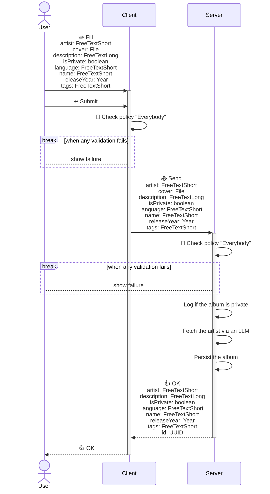
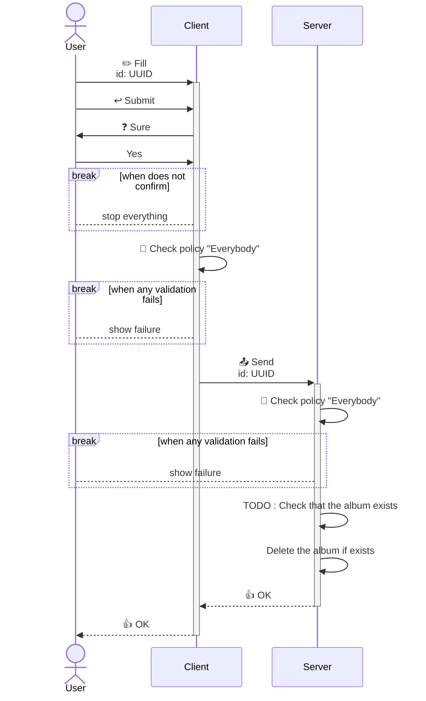
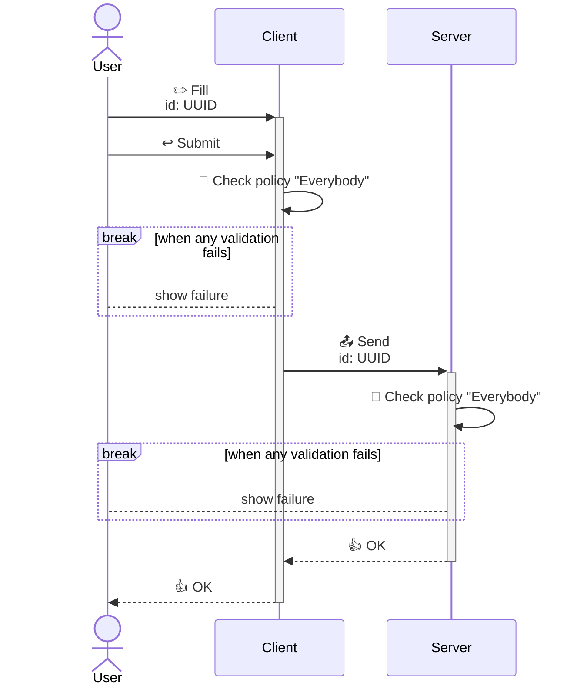
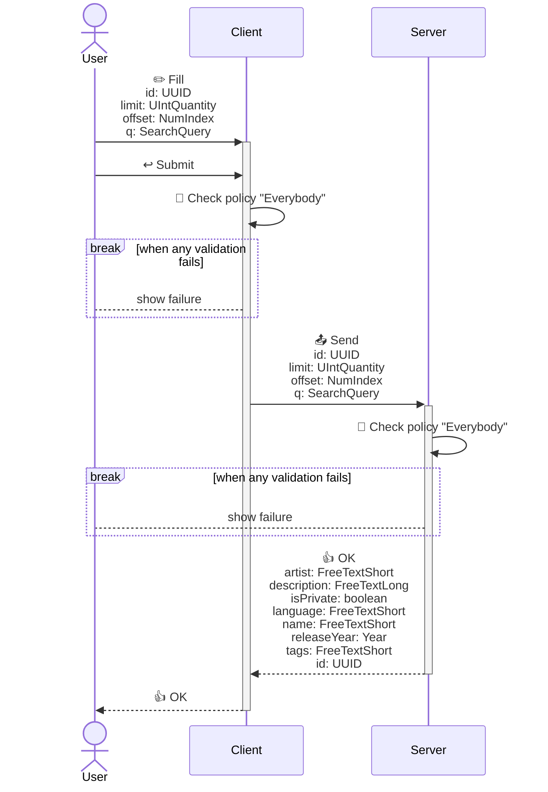
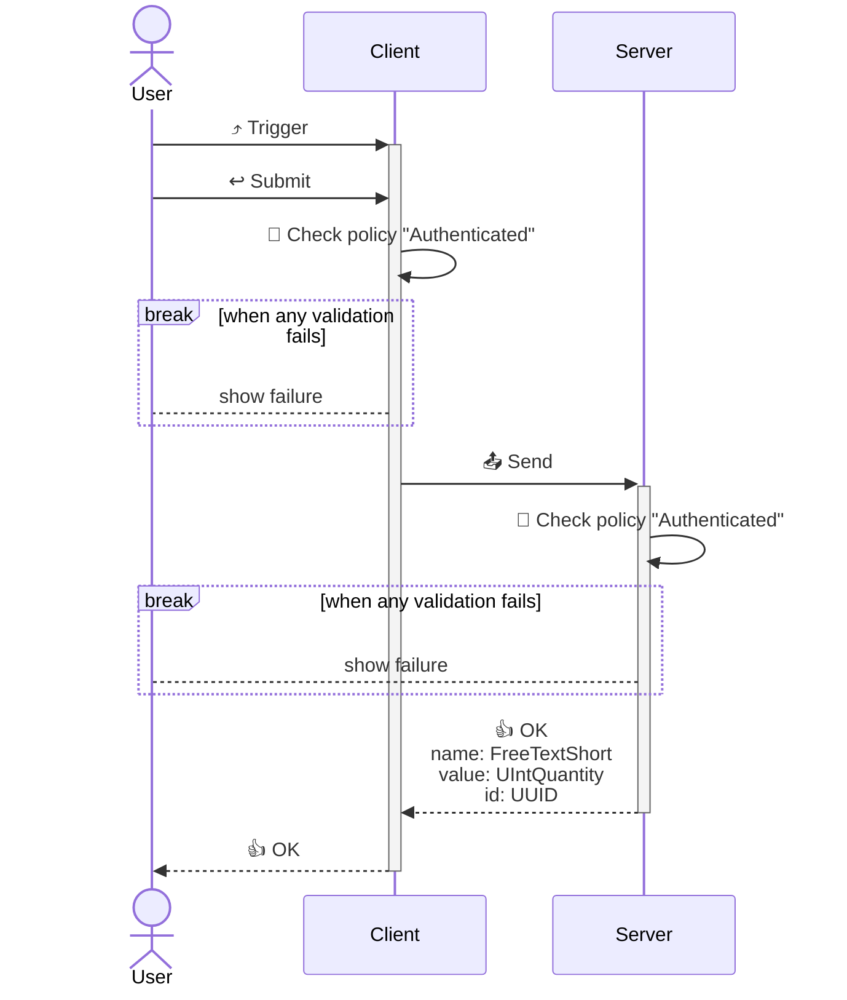
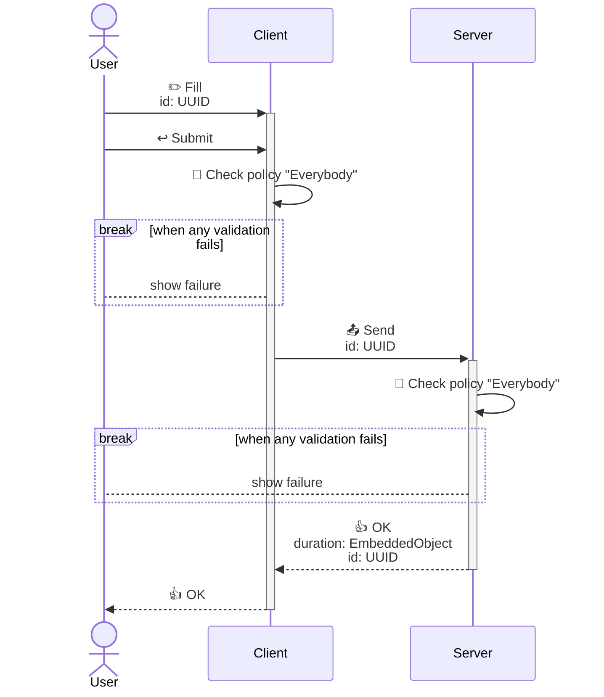

<!---
    All this code has been auto generated.
    DO NOT EDIT.
    Or be prepared to see all your changes erased at the next generation.
-->

# App

## Use Cases

### CreateAlbum

- **Type** : `Client / Server`
- **Client Policy** : `Everybody`
- **Server Policy** : `Everybody`

#### Input (I)

|#|name|humanized|dataType|
|---|---|---|---|
|1|`artist`|Artist|`FreeTextShort`|
|2|`cover`|Cover|`File`|
|3|`description`|Description|`FreeTextLong`|
|4|`isPrivate`|Is Private|`boolean`|
|5|`language`|Language|`FreeTextShort`|
|6|`name`|Name|`FreeTextShort`|
|7|`releaseYear`|Release Year|`Year`|
|8|`tags`|Tags|`FreeTextShort`|

#### Output (O)

##### Part 0 (OPI0)

|#|name|humanized|dataType|
|---|---|---|---|
|1|`artist`|Artist|`FreeTextShort`|
|2|`description`|Description|`FreeTextLong`|
|3|`isPrivate`|Is Private|`boolean`|
|4|`language`|Language|`FreeTextShort`|
|5|`name`|Name|`FreeTextShort`|
|6|`releaseYear`|Release Year|`Year`|
|7|`tags`|Tags|`FreeTextShort`|
|8|`id`|Id|`UUID`|

##### Part 1 (OPI1)

None

#### Sequence Diagram

### DeleteAlbum

- **Type** : `Client / Server`
- **Client Policy** : `Everybody`
- **Server Policy** : `Everybody`

#### Input (I)

|#|name|humanized|dataType|
|---|---|---|---|
|1|`id`|Id|`UUID`|

#### Output (O)

##### Part 0 (OPI0)

None

##### Part 1 (OPI1)

None

#### Sequence Diagram

### LikeAlbum

- **Type** : `Client / Server`
- **Client Policy** : `Everybody`
- **Server Policy** : `Everybody`

#### Input (I)

|#|name|humanized|dataType|
|---|---|---|---|
|1|`id`|Id|`UUID`|

#### Output (O)

##### Part 0 (OPI0)

None

##### Part 1 (OPI1)

None

#### Sequence Diagram

### ListAlbums

- **Type** : `Client / Server`
- **Client Policy** : `Everybody`
- **Server Policy** : `Everybody`

#### Input (I)

|#|name|humanized|dataType|
|---|---|---|---|
|1|`id`|Id|`UUID`|
|2|`limit`|Limit|`UIntQuantity`|
|3|`offset`|Offset|`NumIndex`|
|4|`q`|Q|`SearchQuery`|

#### Output (O)

##### Part 0 (OPI0)

|#|name|humanized|dataType|
|---|---|---|---|
|1|`artist`|Artist|`FreeTextShort`|
|2|`description`|Description|`FreeTextLong`|
|3|`isPrivate`|Is Private|`boolean`|
|4|`language`|Language|`FreeTextShort`|
|5|`name`|Name|`FreeTextShort`|
|6|`releaseYear`|Release Year|`Year`|
|7|`tags`|Tags|`FreeTextShort`|
|8|`id`|Id|`UUID`|

##### Part 1 (OPI1)

None

#### Sequence Diagram

### ListStats

- **Type** : `Client / Server`
- **Client Policy** : `Authenticated`
- **Server Policy** : `Authenticated`

#### Input (I)

None

#### Output (O)

##### Part 0 (OPI0)

|#|name|humanized|dataType|
|---|---|---|---|
|1|`name`|Name|`FreeTextShort`|
|2|`value`|Value|`UIntQuantity`|
|3|`id`|Id|`UUID`|

##### Part 1 (OPI1)

None

#### Sequence Diagram

### PlaySong

- **Type** : `Client / Server`
- **Client Policy** : `Everybody`
- **Server Policy** : `Everybody`

#### Input (I)

|#|name|humanized|dataType|
|---|---|---|---|
|1|`id`|Id|`UUID`|

#### Output (O)

##### Part 0 (OPI0)

|#|name|humanized|dataType|
|---|---|---|---|
|1|`duration`|Duration|`EmbeddedObject`|
|2|`id`|Id|`UUID`|

##### Part 1 (OPI1)

None

#### Sequence Diagram

## Technical Summary

|#|filePath|constName|metadataName|metadataAction|metadataBeta|metadataIcon|metadataNew|metadataSensitive|externalImports|internalImports|ioI|ioIFields|ioOPI0|ioOPI0Fields|ioOPI1|ioOPI1Fields|lifecycleClientPolicy|lifecycleServerPolicy|
|---|---|---|---|---|---|---|---|---|---|---|---|---|---|---|---|---|---|---|
|1|/src/ucds/CreateAlbumUCD.ts|CreateAlbumUCD|CreateAlbum|Create||circle-plus||||../../../../../dist/esm/index.js ../lib/album.js ../manifest.js ./CreateAlbumServerMain.js ./ListAlbumsUCD.js|CreateAlbumInput|artist: UCInputFieldValue&#60;FreeTextShort&#62; cover: UCInputFieldValue&#60;File&#62; description: UCInputFieldValue&#60;FreeTextLong&#62; isPrivate: UCInputFieldValue&#60;boolean&#62; language: UCInputFieldValue&#60;FreeTextShort&#62; name: UCInputFieldValue&#60;FreeTextShort&#62; releaseYear: UCInputFieldValue&#60;Year&#62; tags: UCInputFieldValue&#60;FreeTextShort&#62;|CreateAlbumOPI0|artist: UCOPIValue&#60;FreeTextShort&#62; description: UCOPIValue&#60;FreeTextLong&#62; isPrivate: UCOPIValue&#60;boolean&#62; language: UCOPIValue&#60;FreeTextShort&#62; name: UCOPIValue&#60;FreeTextShort&#62; releaseYear: UCOPIValue&#60;Year&#62; tags: UCOPIValue&#60;FreeTextShort&#62; id: UUID|||Everybody|Everybody|
|2|/src/ucds/DeleteAlbumUCD.ts|DeleteAlbumUCD|DeleteAlbum|Delete||trash-can||true||../../../../../dist/esm/index.js ../manifest.js ./DeleteAlbumServerMain.js|DeleteAlbumInput|id: UCInputFieldValue&#60;UUID&#62;|||||Everybody|Everybody|
|3|/src/ucds/LikeAlbumUCD.ts|LikeAlbumUCD|LikeAlbum|Update||circle-check||||../../../../../dist/esm/index.js ../manifest.js|LikeAlbumInput|id: UCInputFieldValue&#60;UUID&#62;|||||Everybody|Everybody|
|4|/src/ucds/ListAlbumsUCD.ts|ListAlbumsUCD|ListAlbums|List||list||||../../../../../dist/esm/index.js ../lib/album.js ../manifest.js ./ListAlbumsServerMain.js|ListAlbumsInput|id: UCInputFieldValue&#60;UUID&#62; limit: UCInputFieldValue&#60;UIntQuantity&#62; offset: UCInputFieldValue&#60;NumIndex&#62; q: UCInputFieldValue&#60;SearchQuery&#62;|ListAlbumsOPI0|artist: UCOPIValue&#60;FreeTextShort&#62; description: UCOPIValue&#60;FreeTextLong&#62; isPrivate: UCOPIValue&#60;boolean&#62; language: UCOPIValue&#60;FreeTextShort&#62; name: UCOPIValue&#60;FreeTextShort&#62; releaseYear: UCOPIValue&#60;Year&#62; tags: UCOPIValue&#60;FreeTextShort&#62; id: UUID|||Everybody|Everybody|
|5|/src/ucds/ListStatsUCD.ts|ListStatsUCD|ListStats|List||list||||../../../../../dist/esm/index.js ../manifest.js ./ListStatsServerMain.js|ListStatsInput||ListStatsOPI0|name: FreeTextShort value: UIntQuantity id: UUID|||Authenticated|Authenticated|
|6|/src/ucds/PlaySongUCD.ts|PlaySongUCD|PlaySong|View||eye||||../../../../../dist/esm/index.js ../manifest.js ./PlaySongServerMain.js|PlaySongInput|id: UCInputFieldValue&#60;UUID&#62;|PlaySongOPI0|duration: EmbeddedObject&#60;{ hours: UIntDuration minutes: UIntDuration seconds: UIntDuration }&#62; id: UUID|||Everybody|Everybody|
