<!---
    All this code has been auto generated.
    DO NOT EDIT.
    Or be prepared to see all your changes erased at the next generation.
-->

# App

## Use Cases

### CreateAlbum

```mermaid
sequenceDiagram
    actor User
    User->>+Client: ✏️ Fill<br/>artist: FreeTextShort<br/>cover: File<br/>description: FreeTextLong<br/>isPrivate: boolean<br/>language: FreeTextShort<br/>name: FreeTextShort<br/>releaseYear: Year<br/>tags: FreeTextShort
    User->>Client: ↩️ Submit
    Client->>Client: 🔐 Check policy "Everybody"
    break when any validation fails
        Client-->User: show failure
    end
    Client->>+Server: 📤 Send<br/>artist: FreeTextShort<br/>cover: File<br/>description: FreeTextLong<br/>isPrivate: boolean<br/>language: FreeTextShort<br/>name: FreeTextShort<br/>releaseYear: Year<br/>tags: FreeTextShort
    Server->>Server: 🔐 Check policy "Everybody"
    break when any validation fails
        Server-->User: show failure
    end
    Server->>Server: Log if the album is private
    Server->>Server: Fetch the artist via an LLM
    Server->>Server: Persist the album
    Server-->>-Client: 👍 OK<br/>artist: FreeTextShort<br/>description: FreeTextLong<br/>isPrivate: boolean<br/>language: FreeTextShort<br/>name: FreeTextShort<br/>releaseYear: Year<br/>tags: FreeTextShort<br/>id: UUID
    Client-->>-User: 👍 OK
```

### DeleteAlbum

```mermaid
sequenceDiagram
    actor User
    User->>+Client: ✏️ Fill<br/>id: UUID
    User->>Client: ↩️ Submit
    Client->>User: ❓ Sure
    User->>Client: Yes
    break when does not confirm
        Client-->User: stop everything
    end
    Client->>Client: 🔐 Check policy "Everybody"
    break when any validation fails
        Client-->User: show failure
    end
    Client->>+Server: 📤 Send<br/>id: UUID
    Server->>Server: 🔐 Check policy "Everybody"
    break when any validation fails
        Server-->User: show failure
    end
    Server->>Server: TODO : Check that the album exists
    Server->>Server: Delete the album if exists
    Server-->>-Client: 👍 OK
    Client-->>-User: 👍 OK
```

### LikeAlbum

```mermaid
sequenceDiagram
    actor User
    User->>+Client: ✏️ Fill<br/>id: UUID
    User->>Client: ↩️ Submit
    Client->>Client: 🔐 Check policy "Everybody"
    break when any validation fails
        Client-->User: show failure
    end
    Client->>+Server: 📤 Send<br/>id: UUID
    Server->>Server: 🔐 Check policy "Everybody"
    break when any validation fails
        Server-->User: show failure
    end
    Server-->>-Client: 👍 OK
    Client-->>-User: 👍 OK
```

### ListAlbums

```mermaid
sequenceDiagram
    actor User
    User->>+Client: ✏️ Fill<br/>id: UUID<br/>limit: UIntQuantity<br/>offset: NumIndex<br/>q: SearchQuery
    User->>Client: ↩️ Submit
    Client->>Client: 🔐 Check policy "Everybody"
    break when any validation fails
        Client-->User: show failure
    end
    Client->>+Server: 📤 Send<br/>id: UUID<br/>limit: UIntQuantity<br/>offset: NumIndex<br/>q: SearchQuery
    Server->>Server: 🔐 Check policy "Everybody"
    break when any validation fails
        Server-->User: show failure
    end
    Server-->>-Client: 👍 OK<br/>artist: FreeTextShort<br/>description: FreeTextLong<br/>isPrivate: boolean<br/>language: FreeTextShort<br/>name: FreeTextShort<br/>releaseYear: Year<br/>tags: FreeTextShort<br/>id: UUID
    Client-->>-User: 👍 OK
```

### ListStats

```mermaid
sequenceDiagram
    actor User
    User->>+Client: ⤴️ Trigger
    User->>Client: ↩️ Submit
    Client->>Client: 🔐 Check policy "Authenticated"
    break when any validation fails
        Client-->User: show failure
    end
    Client->>+Server: 📤 Send
    Server->>Server: 🔐 Check policy "Authenticated"
    break when any validation fails
        Server-->User: show failure
    end
    Server-->>-Client: 👍 OK<br/>name: FreeTextShort<br/>value: UIntQuantity<br/>id: UUID
    Client-->>-User: 👍 OK
```

### PlaySong

```mermaid
sequenceDiagram
    actor User
    User->>+Client: ✏️ Fill<br/>id: UUID
    User->>Client: ↩️ Submit
    Client->>Client: 🔐 Check policy "Everybody"
    break when any validation fails
        Client-->User: show failure
    end
    Client->>+Server: 📤 Send<br/>id: UUID
    Server->>Server: 🔐 Check policy "Everybody"
    break when any validation fails
        Server-->User: show failure
    end
    Server-->>-Client: 👍 OK<br/>duration: EmbeddedObject<br/>id: UUID
    Client-->>-User: 👍 OK
```

## Technical Summary

|#|filePath|constName|metadataName|metadataAction|metadataBeta|metadataIcon|metadataNew|metadataSensitive|externalImports|internalImports|ioI|ioIFields|ioOPI0|ioOPI0Fields|ioOPI1|ioOPI1Fields|lifecycleClientPolicy|lifecycleServerPolicy|
|---|---|---|---|---|---|---|---|---|---|---|---|---|---|---|---|---|---|---|
|1|/src/ucds/CreateAlbumUCD.ts|CreateAlbumUCD|CreateAlbum|Create||circle-plus||||../../../../../dist/esm/index.js ../lib/album.js ../manifest.js ./CreateAlbumServerMain.js ./ListAlbumsUCD.js|CreateAlbumInput|artist: UCInputFieldValue&#60;FreeTextShort&#62; cover: UCInputFieldValue&#60;File&#62; description: UCInputFieldValue&#60;FreeTextLong&#62; isPrivate: UCInputFieldValue&#60;boolean&#62; language: UCInputFieldValue&#60;FreeTextShort&#62; name: UCInputFieldValue&#60;FreeTextShort&#62; releaseYear: UCInputFieldValue&#60;Year&#62; tags: UCInputFieldValue&#60;FreeTextShort&#62;|CreateAlbumOPI0|artist: UCOPIValue&#60;FreeTextShort&#62; description: UCOPIValue&#60;FreeTextLong&#62; isPrivate: UCOPIValue&#60;boolean&#62; language: UCOPIValue&#60;FreeTextShort&#62; name: UCOPIValue&#60;FreeTextShort&#62; releaseYear: UCOPIValue&#60;Year&#62; tags: UCOPIValue&#60;FreeTextShort&#62; id: UUID|||Everybody|Everybody|
|2|/src/ucds/DeleteAlbumUCD.ts|DeleteAlbumUCD|DeleteAlbum|Delete||trash-can||true||../../../../../dist/esm/index.js ../manifest.js ./DeleteAlbumServerMain.js|DeleteAlbumInput|id: UCInputFieldValue&#60;UUID&#62;|||||Everybody|Everybody|
|3|/src/ucds/LikeAlbumUCD.ts|LikeAlbumUCD|LikeAlbum|Update||circle-check||||../../../../../dist/esm/index.js ../manifest.js|LikeAlbumInput|id: UCInputFieldValue&#60;UUID&#62;|||||Everybody|Everybody|
|4|/src/ucds/ListAlbumsUCD.ts|ListAlbumsUCD|ListAlbums|List||list||||../../../../../dist/esm/index.js ../lib/album.js ../manifest.js ./ListAlbumsServerMain.js|ListAlbumsInput|id: UCInputFieldValue&#60;UUID&#62; limit: UCInputFieldValue&#60;UIntQuantity&#62; offset: UCInputFieldValue&#60;NumIndex&#62; q: UCInputFieldValue&#60;SearchQuery&#62;|ListAlbumsOPI0|artist: UCOPIValue&#60;FreeTextShort&#62; description: UCOPIValue&#60;FreeTextLong&#62; isPrivate: UCOPIValue&#60;boolean&#62; language: UCOPIValue&#60;FreeTextShort&#62; name: UCOPIValue&#60;FreeTextShort&#62; releaseYear: UCOPIValue&#60;Year&#62; tags: UCOPIValue&#60;FreeTextShort&#62; id: UUID|||Everybody|Everybody|
|5|/src/ucds/ListStatsUCD.ts|ListStatsUCD|ListStats|List||list||||../../../../../dist/esm/index.js ../manifest.js ./ListStatsServerMain.js|ListStatsInput||ListStatsOPI0|name: FreeTextShort value: UIntQuantity id: UUID|||Authenticated|Authenticated|
|6|/src/ucds/PlaySongUCD.ts|PlaySongUCD|PlaySong|View||eye||||../../../../../dist/esm/index.js ../manifest.js ./PlaySongServerMain.js|PlaySongInput|id: UCInputFieldValue&#60;UUID&#62;|PlaySongOPI0|duration: EmbeddedObject&#60;{ hours: UIntDuration minutes: UIntDuration seconds: UIntDuration }&#62; id: UUID|||Everybody|Everybody|
