<!---
    All this code has been auto generated.
    DO NOT EDIT.
    Or be prepared to see all your changes erased at the next generation.
-->

# App

## Use Cases

### CreateActivity

- **Type** : `Client only`
- **Client Policy** : `Nobody`
- **Server Policy** : -

#### Input (I)

|#|name|humanized|dataType|
|---|---|---|---|
|1|`date`|Date|`DateISO8601`|
|2|`description`|Description|`FreeTextLong`|
|3|`title`|Title|`FreeTextShort`|
|4|`type`|Type|`ActivityType`|

#### Output (O)

##### Part 0 (OPI0)

|#|name|humanized|dataType|
|---|---|---|---|
|1|`id`|Id|`UUID`|

##### Part 1 (OPI1)

None

#### Sequence Diagram

```mermaid
sequenceDiagram
    actor User
    User->>+Client: ✏️ Fill<br/>date: DateISO8601<br/>description: FreeTextLong<br/>title: FreeTextShort<br/>type: ActivityType
    User->>Client: ↩️ Submit
    Client->>Client: 🔐 Check policy "Nobody"
    break when any validation fails
        Client-->User: show failure
    end
    Client->>Client: Check that the name is serious (i.e. not 'toto')
    Client->>Client: Dispatch on the queue for async processing
    Client-->>-User: 👍 OK
```

## Technical Summary

|#|filePath|constName|metadataName|metadataAction|metadataBeta|metadataIcon|metadataNew|metadataSensitive|externalImports|internalImports|ioI|ioIFields|ioOPI0|ioOPI0Fields|ioOPI1|ioOPI1Fields|lifecycleClientPolicy|lifecycleServerPolicy|
|---|---|---|---|---|---|---|---|---|---|---|---|---|---|---|---|---|---|---|
|1|/src/ucds/CreateActivityUCD.ts|CreateActivityUCD|CreateActivity|Create||circle-plus|||inversify|../../../../../dist/esm/index.js ../lib/ActivityProcessor.js ../lib/TActivityType.js ../manifest.js|CreateActivityInput|date: UCInputFieldValue&#60;DateISO8601&#62; description: UCInputFieldValue&#60;FreeTextLong&#62; title: UCInputFieldValue&#60;FreeTextShort&#62; type: UCInputFieldValue&#60;ActivityType&#62;|CreateActivityOPI0|id: UUID|||Nobody||
