<!---
    All this code has been auto generated.
    DO NOT EDIT.
    Or be prepared to see all your changes erased at the next generation.
-->

# App

## Use Cases

### DecodeJWT

- **Type** : `Client only`
- **Client Policy** : `Everybody`
- **Server Policy** : -

#### Input (I)

|#|name|humanized|dataType|
|---|---|---|---|
|1|`jwt`|Jwt|`JWT`|

#### Output (O)

##### Part 0 (OPI0)

|#|name|humanized|dataType|
|---|---|---|---|
|1|`payload`|Payload|`EmbeddedObject`|
|2|`id`|Id|`UUID`|

##### Part 1 (OPI1)

None

#### Sequence Diagram

```mermaid
sequenceDiagram
    actor User
    User->>+Client: ✏️ Fill<br/>jwt: JWT
    User->>Client: ↩️ Submit
    Client->>Client: 🔐 Check policy "Everybody"
    break when any validation fails
        Client-->User: show failure
    end
    Client->>Client: Decode the JWT
    Client-->>-User: 👍 OK
```

### ExportAsana

- **Type** : `Client only`
- **Client Policy** : `Everybody`
- **Server Policy** : -

#### Input (I)

|#|name|humanized|dataType|
|---|---|---|---|
|1|`accessToken`|Access Token|`Password`|
|2|`projectId`|Project Id|`ExternalServiceId`|

#### Output (O)

##### Part 0 (OPI0)

None

##### Part 1 (OPI1)

None

#### Sequence Diagram

```mermaid
sequenceDiagram
    actor User
    User->>+Client: ✏️ Fill<br/>accessToken: Password<br/>projectId: ExternalServiceId
    User->>Client: ↩️ Submit
    Client->>Client: 🔐 Check policy "Everybody"
    break when any validation fails
        Client-->User: show failure
    end
    Client-->>-User: 👍 OK
```

### GenerateMiscData

- **Type** : `Client only`
- **Client Policy** : `Everybody`
- **Server Policy** : -

#### Input (I)

|#|name|humanized|dataType|
|---|---|---|---|
|1|`uuidCount`|Uuid Count|`UIntQuantity`|

#### Output (O)

##### Part 0 (OPI0)

|#|name|humanized|dataType|
|---|---|---|---|
|1|`label`|Label|`FreeTextShort`|
|2|`value`|Value|`FreeTextShort`|
|3|`id`|Id|`UUID`|

##### Part 1 (OPI1)

|#|name|humanized|dataType|
|---|---|---|---|
|1|`value`|Value|`UUID`|
|2|`id`|Id|`UUID`|

#### Sequence Diagram

```mermaid
sequenceDiagram
    actor User
    User->>+Client: ✏️ Fill<br/>uuidCount: UIntQuantity
    User->>Client: ↩️ Submit
    Client->>Client: 🔐 Check policy "Everybody"
    break when any validation fails
        Client-->User: show failure
    end
    Client-->>-User: 👍 OK
```

### GeocodeAddress

- **Type** : `Client only`
- **Client Policy** : `Everybody`
- **Server Policy** : -

#### Input (I)

|#|name|humanized|dataType|
|---|---|---|---|
|1|`address`|Address|`Address`|

#### Output (O)

##### Part 0 (OPI0)

|#|name|humanized|dataType|
|---|---|---|---|
|1|`geolocation`|Geolocation|`Geolocation`|
|2|`googleMapsURL`|Google Maps URL|`URL`|
|3|`id`|Id|`UUID`|

##### Part 1 (OPI1)

None

#### Sequence Diagram

```mermaid
sequenceDiagram
    actor User
    User->>+Client: ✏️ Fill<br/>address: Address
    User->>Client: ↩️ Submit
    Client->>Client: 🔐 Check policy "Everybody"
    break when any validation fails
        Client-->User: show failure
    end
    Client-->>-User: 👍 OK
```

### PromptLLM

- **Type** : `Client only`
- **Client Policy** : `Everybody`
- **Server Policy** : -

#### Input (I)

|#|name|humanized|dataType|
|---|---|---|---|
|1|`apiKey`|Api Key|`ApiKey`|
|2|`modelName`|Model Name|`Slug`|
|3|`prompt`|Prompt|`FreeTextLong`|
|4|`transportType`|Transport Type|`TransportType`|

#### Output (O)

##### Part 0 (OPI0)

|#|name|humanized|dataType|
|---|---|---|---|
|1|`res`|Res|`FreeTextLong`|
|2|`id`|Id|`UUID`|

##### Part 1 (OPI1)

None

#### Sequence Diagram

```mermaid
sequenceDiagram
    actor User
    User->>+Client: ✏️ Fill<br/>apiKey: ApiKey<br/>modelName: Slug<br/>prompt: FreeTextLong<br/>transportType: TransportType
    User->>Client: ↩️ Submit
    Client->>Client: 🔐 Check policy "Everybody"
    break when any validation fails
        Client-->User: show failure
    end
    Client-->>-User: 👍 OK
```

## Technical Summary

|#|filePath|constName|metadataName|metadataAction|metadataBeta|metadataIcon|metadataNew|metadataSensitive|externalImports|internalImports|ioI|ioIFields|ioOPI0|ioOPI0Fields|ioOPI1|ioOPI1Fields|lifecycleClientPolicy|lifecycleServerPolicy|
|---|---|---|---|---|---|---|---|---|---|---|---|---|---|---|---|---|---|---|
|1|/src/ucds/DecodeJWTUCD.ts|DecodeJWTUCD|DecodeJWT|Create||gears|||inversify|../../../../../dist/esm/index.js ../manifest.js|DecodeJWTInput|jwt: UCInputFieldValue&#60;JWT&#62;|DecodeJWTOPI0|payload: EmbeddedObject id: UUID|||Everybody||
|2|/src/ucds/ExportAsanaUCD.ts|ExportAsanaUCD|ExportAsana|Create||rotate|||inversify|../../../../../dist/esm/index.js ../manifest.js|ExportAsanaInput|accessToken: UCInputFieldValue&#60;Password&#62; projectId: UCInputFieldValue&#60;ExternalServiceId&#62;|||||Everybody||
|3|/src/ucds/GenerateMiscDataUCD.ts|GenerateMiscDataUCD|GenerateMiscData|Create||gear|||inversify|../../../../../dist/esm/index.js ../manifest.js|GenerateMiscDataInput|uuidCount: UCInputFieldValue&#60;UIntQuantity&#62;|GenerateMiscDataOPI0|label: FreeTextShort value: FreeTextShort id: UUID|GenerateMiscDataOPI1|value: UUID id: UUID|Everybody||
|4|/src/ucds/GeocodeAddressUCD.ts|GeocodeAddressUCD|GeocodeAddress|Create||gear|||inversify|../../../../../dist/esm/index.js ../lib/geocoding/GeocodingManager.js ../manifest.js|GeocodeAddressInput|address: UCInputFieldValue&#60;Address&#62;|GeocodeAddressOPI0|geolocation: UCOPIValue&#60;Geolocation&#62; googleMapsURL: UCOPIValue&#60;URL&#62; id: UUID|||Everybody||
|5|/src/ucds/PromptLLMUCD.ts|PromptLLMUCD|PromptLLM|Create||gear|||inversify|../../../../../dist/esm/index.js ../manifest.js|PromptLLMInput|apiKey: UCInputFieldValue&#60;ApiKey&#62; modelName: UCInputFieldValue&#60;Slug&#62; prompt: UCInputFieldValue&#60;FreeTextLong&#62; transportType: UCInputFieldValue&#60;TransportType&#62;|PromptLLMOPI0|res: FreeTextLong id: UUID|||Everybody||
