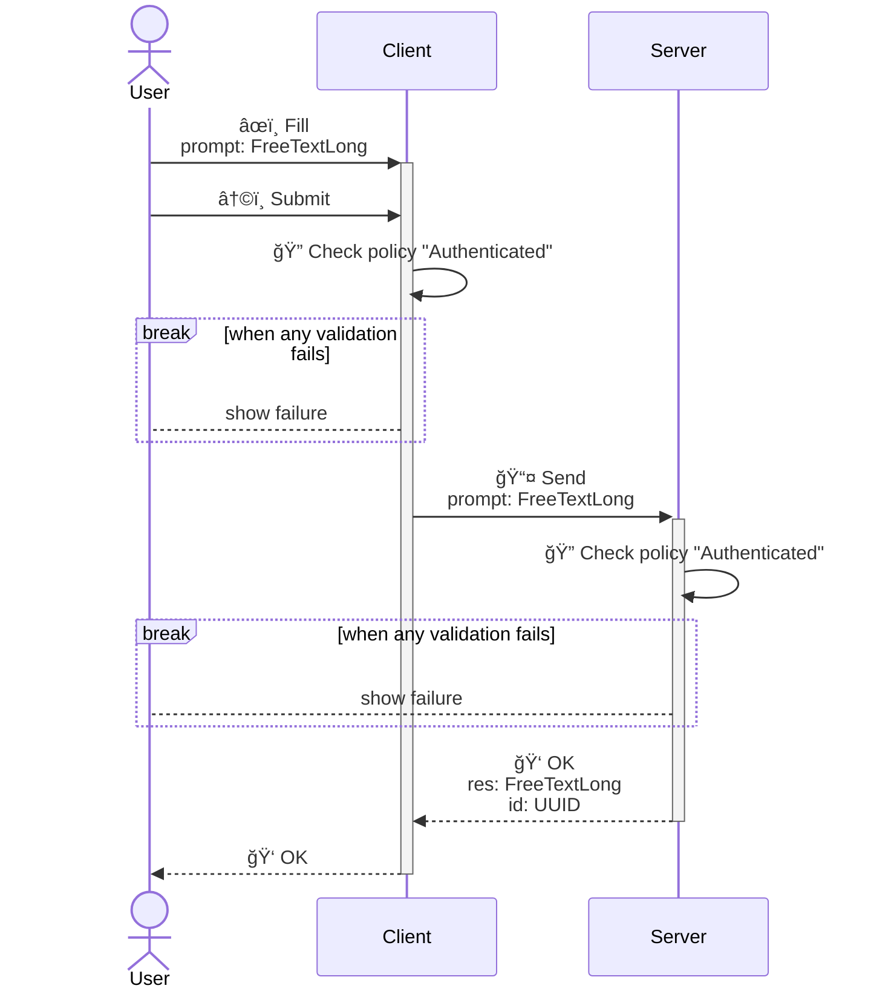
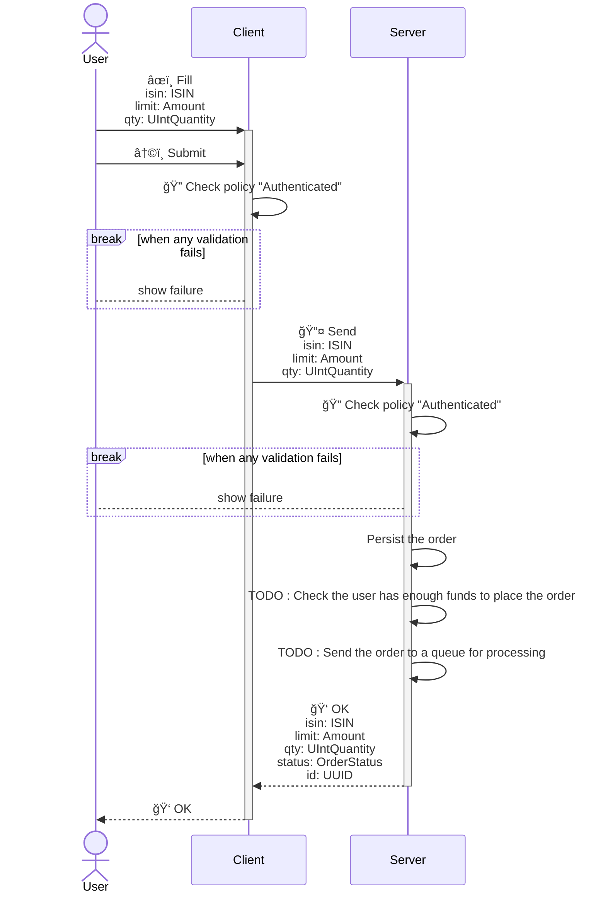
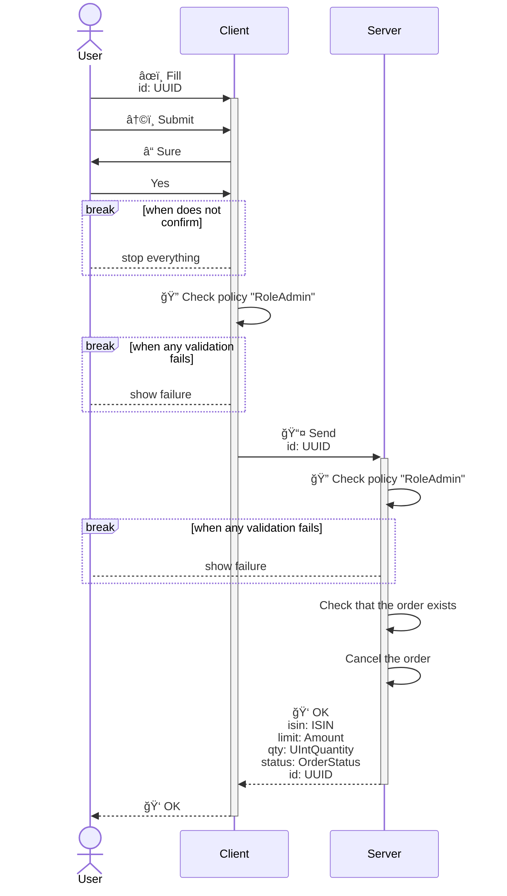
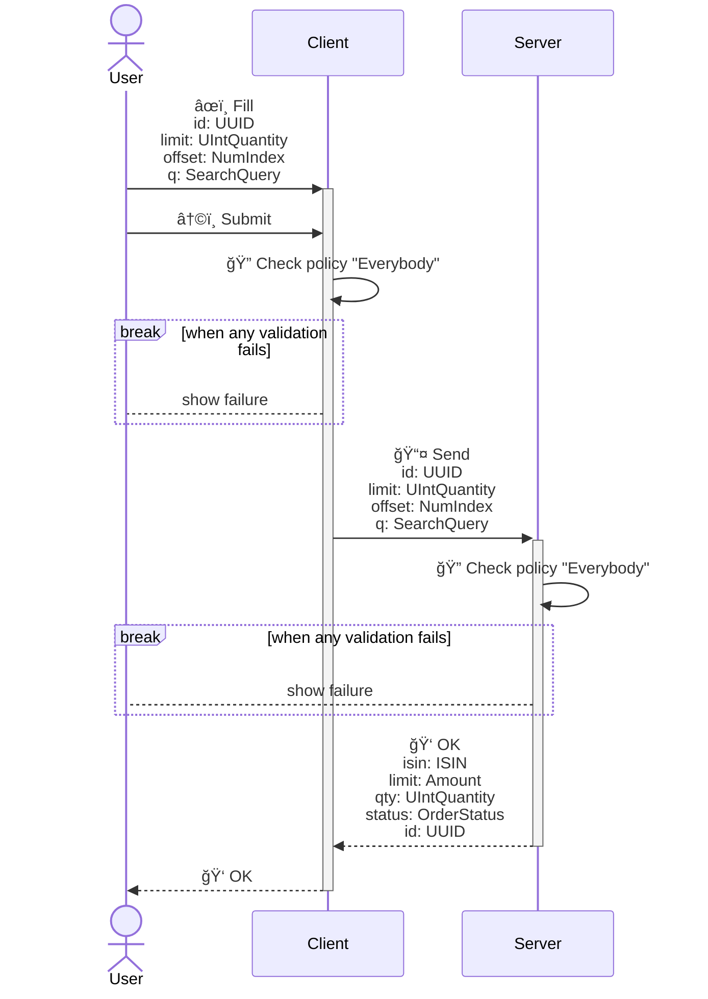
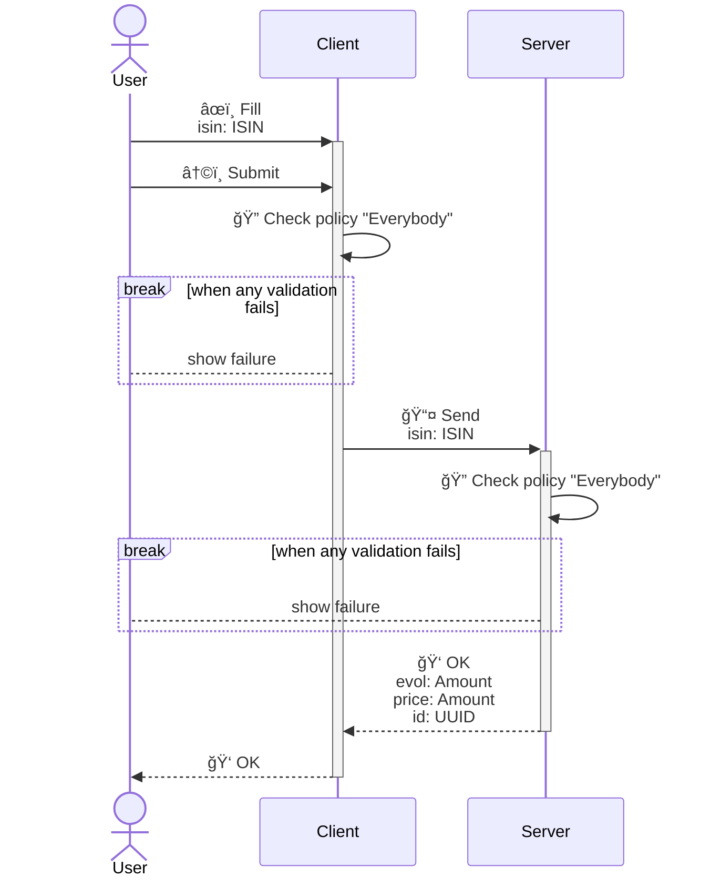

<!---
    All this code has been auto generated.
    DO NOT EDIT.
    Or be prepared to see all your changes erased at the next generation.
-->

# App

## Use Cases

### AskQuestion

- **Type** : `Client / Server`
- **Client Policy** : `Authenticated`
- **Server Policy** : `Authenticated`

#### Input (I)

|#|name|humanized|dataType|
|---|---|---|---|
|1|`prompt`|Prompt|`FreeTextLong`|

#### Output (O)

##### Part 0 (OPI0)

|#|name|humanized|dataType|
|---|---|---|---|
|1|`res`|Res|`FreeTextLong`|
|2|`id`|Id|`UUID`|

##### Part 1 (OPI1)

None

#### Sequence Diagram

### BuyAsset

- **Type** : `Client / Server`
- **Client Policy** : `Authenticated`
- **Server Policy** : `Authenticated`

#### Input (I)

|#|name|humanized|dataType|
|---|---|---|---|
|1|`isin`|Isin|`ISIN`|
|2|`limit`|Limit|`Amount`|
|3|`qty`|Qty|`UIntQuantity`|

#### Output (O)

##### Part 0 (OPI0)

|#|name|humanized|dataType|
|---|---|---|---|
|1|`isin`|Isin|`ISIN`|
|2|`limit`|Limit|`Amount`|
|3|`qty`|Qty|`UIntQuantity`|
|4|`status`|Status|`OrderStatus`|
|5|`id`|Id|`UUID`|

##### Part 1 (OPI1)

None

#### Sequence Diagram

### CancelOrder

- **Type** : `Client / Server`
- **Client Policy** : `RoleAdmin`
- **Server Policy** : `RoleAdmin`

#### Input (I)

|#|name|humanized|dataType|
|---|---|---|---|
|1|`id`|Id|`UUID`|

#### Output (O)

##### Part 0 (OPI0)

|#|name|humanized|dataType|
|---|---|---|---|
|1|`isin`|Isin|`ISIN`|
|2|`limit`|Limit|`Amount`|
|3|`qty`|Qty|`UIntQuantity`|
|4|`status`|Status|`OrderStatus`|
|5|`id`|Id|`UUID`|

##### Part 1 (OPI1)

None

#### Sequence Diagram

### ListOrders

- **Type** : `Client / Server`
- **Client Policy** : `Everybody`
- **Server Policy** : `Everybody`

#### Input (I)

|#|name|humanized|dataType|
|---|---|---|---|
|1|`id`|Id|`UUID`|
|2|`limit`|Limit|`UIntQuantity`|
|3|`offset`|Offset|`NumIndex`|
|4|`q`|Q|`SearchQuery`|

#### Output (O)

##### Part 0 (OPI0)

|#|name|humanized|dataType|
|---|---|---|---|
|1|`isin`|Isin|`ISIN`|
|2|`limit`|Limit|`Amount`|
|3|`qty`|Qty|`UIntQuantity`|
|4|`status`|Status|`OrderStatus`|
|5|`id`|Id|`UUID`|

##### Part 1 (OPI1)

None

#### Sequence Diagram

### ViewAssetPrice

- **Type** : `Client / Server`
- **Client Policy** : `Everybody`
- **Server Policy** : `Everybody`

#### Input (I)

|#|name|humanized|dataType|
|---|---|---|---|
|1|`isin`|Isin|`ISIN`|

#### Output (O)

##### Part 0 (OPI0)

|#|name|humanized|dataType|
|---|---|---|---|
|1|`evol`|Evol|`Amount`|
|2|`price`|Price|`Amount`|
|3|`id`|Id|`UUID`|

##### Part 1 (OPI1)

None

#### Sequence Diagram

## Technical Summary

|#|filePath|constName|metadataName|metadataAction|metadataBeta|metadataIcon|metadataNew|metadataSensitive|externalImports|internalImports|ioI|ioIFields|ioOPI0|ioOPI0Fields|ioOPI1|ioOPI1Fields|lifecycleClientPolicy|lifecycleServerPolicy|
|---|---|---|---|---|---|---|---|---|---|---|---|---|---|---|---|---|---|---|
|1|/src/ucds/AskQuestionUCD.ts|AskQuestionUCD|AskQuestion|Search||list||||../../../../../dist/esm/index.js ../manifest.js ./AskQuestionServerMain.js|AskQuestionInput|prompt: UCInputFieldValue&#60;FreeTextLong&#62;|AskQuestionOPI0|res: FreeTextLong id: UUID|||Authenticated|Authenticated|
|2|/src/ucds/BuyAssetUCD.ts|BuyAssetUCD|BuyAsset|Create||plus||||../../../../../dist/esm/index.js ../lib/order.js ../lib/TISIN.js ../manifest.js ./BuyAssetServerMain.js|BuyAssetInput|isin: UCInputFieldValue&#60;ISIN&#62; limit: UCInputFieldValue&#60;Amount&#62; qty: UCInputFieldValue&#60;UIntQuantity&#62;|BuyAssetOPI0|isin: ISIN limit: Amount qty: UIntQuantity status: OrderStatus id: UUID|||Authenticated|Authenticated|
|3|/src/ucds/CancelOrderUCD.ts|CancelOrderUCD|CancelOrder|Delete||circle-xmark||true||../../../../../dist/esm/index.js ../lib/order.js ../manifest.js ./CancelOrderServerMain.js|CancelOrderInput|id: UCInputFieldValue&#60;UUID&#62;|CancelOrderOPI0|isin: ISIN limit: Amount qty: UIntQuantity status: OrderStatus id: UUID|||RoleAdmin|RoleAdmin|
|4|/src/ucds/ListOrdersUCD.ts|ListOrdersUCD|ListOrders|List||list||||../../../../../dist/esm/index.js ../lib/order.js ../manifest.js ./ListOrdersServerMain.js|ListOrdersInput|id: UCInputFieldValue&#60;UUID&#62; limit: UCInputFieldValue&#60;UIntQuantity&#62; offset: UCInputFieldValue&#60;NumIndex&#62; q: UCInputFieldValue&#60;SearchQuery&#62;|ListOrdersOPI0|isin: ISIN limit: Amount qty: UIntQuantity status: OrderStatus id: UUID|||Everybody|Everybody|
|5|/src/ucds/ViewAssetPriceUCD.ts|ViewAssetPriceUCD|ViewAssetPrice|View||money-bill-wave||||../../../../../dist/esm/index.js ../lib/TAssetPrice.js ../lib/TISIN.js ../manifest.js ./ViewAssetPriceServerMain.js|ViewAssetPriceInput|isin: UCInputFieldValue&#60;ISIN&#62;|ViewAssetPriceOPI0|evol: Amount price: Amount id: UUID|||Everybody|Everybody|
