<!---
    All this code has been auto generated.
    DO NOT EDIT.
    Or be prepared to see all your changes erased at the next generation.
-->

# App

## Use Cases

### BuyAsset

```mermaid
sequenceDiagram
    actor User
    User->>+Client: ✏️ Fill<br/>isin: ISIN<br/>limit: Amount<br/>qty: UIntQuantity
    User->>Client: ↩️ Submit
    Client->>Client: 🔐 Check policy "Everybody"
    break when any validation fails
        Client-->User: show failure
    end
    Client->>+Server: 📤 Send<br/>isin: ISIN<br/>limit: Amount<br/>qty: UIntQuantity
    Server->>Server: 🔐 Check policy "Everybody"
    break when any validation fails
        Server-->User: show failure
    end
    Server->>Server: Persist the order
    Server->>Server: TODO : Check the user has enough funds to place the order
    Server->>Server: TODO : Send the order to a queue for processing
    Server-->>-Client: 👍 OK<br/>executedDirectly: boolean<br/>id: UUID
    Client-->>-User: 👍 OK
```

## Technical Summary

|#|filePath|constName|metadataName|metadataAction|metadataBeta|metadataIcon|metadataNew|metadataSensitive|externalImports|internalImports|ioI|ioIFields|ioOPI0|ioOPI0Fields|ioOPI1|ioOPI1Fields|lifecycleClientPolicy|lifecycleServerPolicy|
|---|---|---|---|---|---|---|---|---|---|---|---|---|---|---|---|---|---|---|
|1|/src/ucds/BuyAssetUCD.ts|BuyAssetUCD|BuyAsset|Create||plus|||inversify libmodulor|../manifest.js ../dt/TISIN.js ./BuyAssetServerMain.js|BuyAssetInput|isin: UCInputFieldValue&#60;ISIN&#62; limit: UCInputFieldValue&#60;Amount&#62; qty: UCInputFieldValue&#60;UIntQuantity&#62;|BuyAssetOPI0|executedDirectly: boolean id: UUID|||Everybody|Everybody|
