<!---
    All this code has been auto generated.
    DO NOT EDIT.
    Or be prepared to see all your changes erased at the next generation.
-->

# App

## Use Cases

### ExportAsana

```mermaid
sequenceDiagram
    actor User
    User->>+Client: ✏️ Fill<br/>accessToken: Password<br/>projectId: ExternalServiceId
    User->>Client: ↩️ Submit
    Client->>Client: 🔐 Check policy "Everybody"
    break when any validation fails
        Client-->User: show failure
    end
    Client-->>-User: 👍 OK
```

### GenerateMiscData

```mermaid
sequenceDiagram
    actor User
    User->>+Client: ✏️ Fill<br/>uuidCount: UIntQuantity
    User->>Client: ↩️ Submit
    Client->>Client: 🔐 Check policy "Everybody"
    break when any validation fails
        Client-->User: show failure
    end
    Client-->>-User: 👍 OK
```

### GeocodeAddress

```mermaid
sequenceDiagram
    actor User
    User->>+Client: ✏️ Fill<br/>address: Address
    User->>Client: ↩️ Submit
    Client->>Client: 🔐 Check policy "Everybody"
    break when any validation fails
        Client-->User: show failure
    end
    Client-->>-User: 👍 OK
```

### PromptLLM

```mermaid
sequenceDiagram
    actor User
    User->>+Client: ✏️ Fill<br/>apiKey: ApiKey<br/>modelName: Slug<br/>prompt: FreeTextLong<br/>transportType: TransportType
    User->>Client: ↩️ Submit
    Client->>Client: 🔐 Check policy "Everybody"
    break when any validation fails
        Client-->User: show failure
    end
    Client-->>-User: 👍 OK
```

## Technical Summary

|#|filePath|constName|metadataName|metadataAction|metadataBeta|metadataIcon|metadataNew|metadataSensitive|externalImports|internalImports|ioI|ioIFields|ioOPI0|ioOPI0Fields|ioOPI1|ioOPI1Fields|lifecycleClientPolicy|lifecycleServerPolicy|
|---|---|---|---|---|---|---|---|---|---|---|---|---|---|---|---|---|---|---|
|1|/src/ucds/ExportAsanaUCD.ts|ExportAsanaUCD|ExportAsana|Create||rotate|||inversify libmodulor|../manifest.js|ExportAsanaInput|accessToken: UCInputFieldValue&#60;Password&#62; projectId: UCInputFieldValue&#60;ExternalServiceId&#62;|||||Everybody||
|2|/src/ucds/GenerateMiscDataUCD.ts|GenerateMiscDataUCD|GenerateMiscData|Create||gear|||inversify libmodulor|../manifest.js|GenerateMiscDataInput|uuidCount: UCInputFieldValue&#60;UIntQuantity&#62;|GenerateMiscDataOPI0|label: FreeTextShort value: FreeTextShort id: UUID|GenerateMiscDataOPI1|value: UUID id: UUID|Everybody||
|3|/src/ucds/GeocodeAddressUCD.ts|GeocodeAddressUCD|GeocodeAddress|Create||gear|||inversify libmodulor|../lib/geocoding/GeocodingManager.js ../manifest.js|GeocodeAddressInput|address: UCInputFieldValue&#60;Address&#62;|GeocodeAddressOPI0|geolocation: UCOPIValue&#60;Geolocation&#62; googleMapsURL: UCOPIValue&#60;URL&#62; id: UUID|||Everybody||
|4|/src/ucds/PromptLLMUCD.ts|PromptLLMUCD|PromptLLM|Create||gear|||inversify libmodulor|../manifest.js|PromptLLMInput|apiKey: UCInputFieldValue&#60;ApiKey&#62; modelName: UCInputFieldValue&#60;Slug&#62; prompt: UCInputFieldValue&#60;FreeTextLong&#62; transportType: UCInputFieldValue&#60;TransportType&#62;|PromptLLMOPI0|res: FreeTextLong id: UUID|||Everybody||
